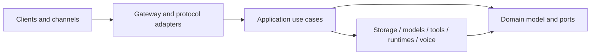

# Architecture Index

The canonical design is split by ownership boundary. This file is an index, not a duplicate specification.

## System Shape

JARVIS uses a daemon/client topology. `jarvisd` is the only process allowed to coordinate canonical identity, policy, approvals, memory, workflow state, and audit history. User interfaces and external agents are authenticated clients.

The dependency rule is inward: applications and adapters depend on domain interfaces; the domain never imports Axum, SQLx, provider SDKs, Tauri, OpenClaw, LangGraph, or ElevenLabs.

## Canonical Specifications

- [Overview and process topology](docs/architecture/overview.md)
- [Repository ownership and dependency rules](docs/architecture/repository-layout.md)
- [Runtime and model architecture](docs/architecture/runtime-and-models.md)
- [Tools, MCP, and connectors](docs/architecture/tools-and-connectors.md)
- [Memory and context](docs/architecture/memory-and-context.md)
- [Identity and workspaces](docs/architecture/identity-and-workspaces.md)
- [Storage and data ownership](docs/architecture/storage.md)
- [Events, scheduler, and workflows](docs/architecture/events-and-workflows.md)
- [Voice and telephony](docs/architecture/voice-and-telephony.md)
- [Security and threat model](docs/architecture/security.md)
- [Public and internal protocols](docs/architecture/protocols.md)
- [Conceptual data schema](docs/data/schema.md)
- [API and adapter contracts](docs/api/contracts.md)

## Integration Research

Records for external contracts and the platform primitives JARVIS depends on live
in [docs/research/integrations](docs/research/integrations/README.md). Each record
states the exact versions, limits, and unresolved ambiguities that implementation
must satisfy; the index lists current status per integration.

## Decisions

Accepted decisions live in [docs/adr](docs/adr/README.md). A change requires a new or superseding ADR when it alters process topology, trust boundaries, canonical data ownership, public protocol semantics, storage guarantees, or extension isolation.

## Delivery

- [Roadmap](ROADMAP.md)
- [Backlog](TODO.md)
- [Acceptance scenarios](docs/quality/acceptance-tests.md)
- [Testing strategy](docs/development/testing.md)
- [Definition of done](docs/development/definition-of-done.md)
- [Install and release plan](docs/operations/install-and-release.md)
- [Observability and diagnostics](docs/operations/observability.md)
- [Prototype migration](docs/migration/python-prototype.md)