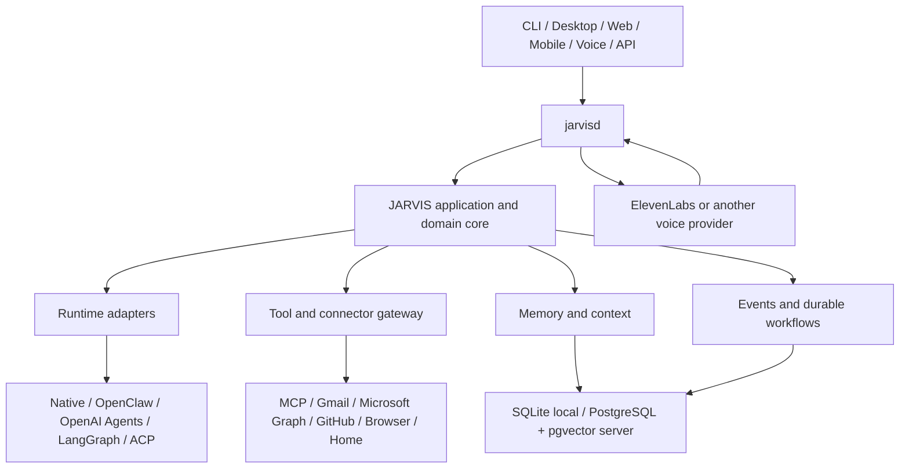

# JARVIS

JARVIS is a planned cross-platform personal AI operating system: a persistent, installable service that can reason, remember, use tools, run durable workflows, react to events, and communicate through text, desktop, web, API, and voice.

This repository is currently in the **local-foundation stage** (Phase 1). The daemon and CLI are runnable: `jarvisd` owns a singleton lock, versioned configuration, SQLite state, structured redacted logs, and a native local control endpoint, and `jarvis status` / `jarvis health` / `jarvis logs` / `jarvis doctor` / `jarvis service` observe and diagnose it locally. A `--root <dir>` portable mode keeps every managed file inside one explicit directory. Models, tools, memory, workflows, and voice are not implemented. The existing [Python example](example/readme.md) is a behavior reference and prototype, not the production core.

## Product Goal

The finished system should let a person install JARVIS on Windows, macOS, or Linux and then use the same trusted core from a CLI, desktop app, browser, phone, or another agent. JARVIS may use OpenClaw, OpenAI Agents, LangGraph, local models, ElevenLabs, Gmail, Outlook, Home Assistant, and future systems, but none of them owns JARVIS.



## Non-Negotiable Boundaries

- Rust is the durable control plane.
- `jarvisd` owns identity, sessions, policy, approvals, tools, memory, workflow state, events, secrets, APIs, and audit records.
- Models suggest. Deterministic policy authorizes.
- Agent frameworks are replaceable runtimes, normally isolated out of process.
- MCP is an interoperability boundary, not JARVIS's internal domain model.
- Voice is an interface, not a separate brain or source of truth.
- SQLite is the zero-dependency local default; PostgreSQL plus pgvector is the server and multi-device backend.
- External API work starts with current official documentation or an official `llms.txt` index and leaves a dated research record.

## Read First

1. [Product requirements](docs/product/requirements.md)
2. [Architecture overview](docs/architecture/overview.md)
3. [Repository layout](docs/architecture/repository-layout.md)
4. [Roadmap](ROADMAP.md)
5. [Implementation backlog](TODO.md)
6. [Engineering instructions](AGENTS.md)
7. [External integration research workflow](docs/development/external-research.md)
8. [Definition of done](docs/development/definition-of-done.md)

The [architecture index](ARCHITECTURE.md) links the subsystem specifications and accepted Architecture Decision Records (ADRs).

## Intended Product Surfaces

- `jarvisd`: long-running daemon and sole owner of durable application state.
- `jarvis`: CLI and administration client.
- `jarvis-desktop`: optional Tauri desktop client.
- Versioned HTTP, WebSocket, SSE, local IPC, MCP, and OpenAI-compatible endpoints.
- Provider-neutral runtime, model, tool, connector, storage, workflow, and voice ports.

## Current Workspace

```text
jarvis-improved/
|-- Cargo.toml            Rust workspace and lint policy
|-- rust-toolchain.toml   Pinned compiler, Clippy, and rustfmt
|-- AGENTS.md              Repository-wide AI engineering rules
|-- README.md              Product entry point
|-- ARCHITECTURE.md        Architecture document index
|-- ROADMAP.md             Ordered release phases and gates
|-- TODO.md                Executable implementation backlog
|-- apps/                  Daemon and CLI composition roots
|-- crates/                Domain, application, protocol, and storage crates
|-- docs/                  Canonical specifications and ADRs
`-- example/               Licensed Python prototype used as a behavior reference
```

The target source tree is specified in [repository-layout.md](docs/architecture/repository-layout.md). It is created incrementally in the order defined by [TODO.md](TODO.md); absent crates and directories are not implied implementations.

## Prototype Notice

The example identifies itself as CC BY-NC 4.0 and contains patterns that are unsuitable for the production trust boundary, including plaintext credential storage and in-process tool execution. Do not silently move its code into the new platform. Preserve useful behavior through documented acceptance tests and clean-room implementations unless license compatibility is explicitly established.

## License Status

No license has yet been selected for the new JARVIS platform. Distribution outside applicable default copyright rules is blocked until the owner chooses one. Third-party source and documentation research is tracked in [THIRD_PARTY.md](THIRD_PARTY.md).