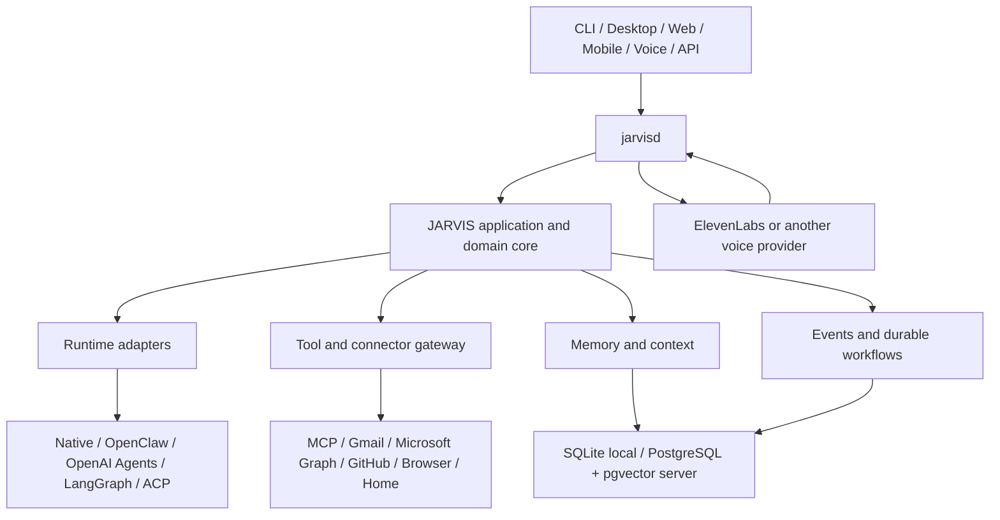

# JARVIS

JARVIS is a planned cross-platform personal AI operating system: a persistent, installable service that can reason, remember, use tools, run durable workflows, react to events, and communicate through text, desktop, web, API, and voice.

This repository is in the **working-assistant stage**: `jarvisd` and `jarvis` run end to end against a local or hosted OpenAI-compatible model (Ollama on this computer or in the cloud, OpenAI, Gemini, Anthropic's compatible endpoint, or any other), with an optional fallback model at a second provider. `jarvis init` and `jarvis start` set it up and open the browser console at `http://127.0.0.1:8765/` (`jarvis hud`), where you talk to it by text or voice, watch what it is doing live (the sources it reads, the tools it calls), answer its questions with a yes or no, and change every setting. What it can do today, under a policy and approvals that survive a restart:

- **Files and documents:** read, search, write, edit and move files in folders you grant; read PDF, Word, spreadsheet and slide files, and photos or scanned PDFs when `tesseract` is installed.
- **The web:** search (with a key) and fetch pages and PDFs, in parts, with sources shown.
- **Gmail and Google Calendar** after you sign in once from Settings: search and read mail, send mail with attachments and replies, save drafts, save attachments, read and create events (anything that reaches another person asks you first).
- **Projects:** a goal, standing guidance and a journal per project, with daily caps on scheduled runs and on tokens; a contacts list that stops it writing to someone you marked do-not-contact; a daily digest and an optional push to your phone.
- **Work that continues without you:** scheduled tasks, sub-agents, resume after a restart, code and shell commands (the shell tool is held for you by default), memory it proposes and you confirm.
- **Oversight:** approvals, `jarvis cancel` as a kill switch, an audit trail, and a token count for every model call; `jarvis eval` runs a suite of prompts against it and compares with the last run, so a change to a prompt, a tool or a model can be measured.

Telephony, messaging apps, Microsoft and GitHub connectors, the desktop client, installers and external agent runtimes are not built. Google's push and watch framework in `jarvis-connectors` is tested but not wired into the daemon (`TODO.md`, `P5-005b`). [ROADMAP.md](ROADMAP.md) has the current direction and the next slices; [TODO.md](TODO.md) is the ledger. A `--root <dir>` portable mode keeps every managed file inside one explicit directory. The existing [Python example](example/readme.md) is a behavior reference and prototype, not the production core.
## Quick start

Build it (`cargo build --release`), and run `jarvis` (one program; the daemon is the same file, `jarvis daemon`). The first run asks a few questions,
starts the assistant and opens its console in your browser. See [docs/user/quick-start.md](docs/user/quick-start.md), [docs/user/platforms.md](docs/user/platforms.md) (Linux server, macOS, Windows: what is verified) and [docs/user/settings.md](docs/user/settings.md) (every setting, its default, and why a few are off until you turn them on); the
target onboarding experience (including the console's Settings screen, `jarvis config` and `jarvis keys`) and what is still missing from it is [docs/product/onboarding.md](docs/product/onboarding.md).

## Product Goal

The finished system should let a person install JARVIS on Windows, macOS, or Linux and then use the same trusted core from a CLI, desktop app, browser, phone, or another agent. JARVIS may use OpenClaw, OpenAI Agents, LangGraph, local models, ElevenLabs, Gmail, Outlook, Home Assistant, and future systems, but none of them owns JARVIS.


```mermaid
flowchart TB
    UI[CLI / Desktop / Web / Mobile / Voice / API] --> D[jarvisd]
    D --> C[JARVIS application and domain core]
    C --> R[Runtime adapters]
    C --> T[Tool and connector gateway]
    C --> M[Memory and context]
    C --> W[Events and durable workflows]
    R --> RX[Native / OpenClaw / OpenAI Agents / LangGraph / ACP]
    T --> TX[MCP / Gmail / Microsoft Graph / GitHub / Browser / Home]
    M --> DB[SQLite local / PostgreSQL + pgvector server]
    W --> DB
    V[ElevenLabs or another voice provider] --> D
    D --> V
```

## Non-Negotiable Boundaries

- Rust is the durable control plane.
- `jarvisd` owns identity, sessions, policy, approvals, tools, memory, workflow state, events, secrets, APIs, and audit records.
- Models suggest. Deterministic policy authorizes.
- Agent frameworks are replaceable runtimes, normally isolated out of process.
- MCP is an interoperability boundary, not JARVIS's internal domain model.
- Voice is an interface, not a separate brain or source of truth.
- SQLite is the zero-dependency local default; PostgreSQL plus pgvector is the server and multi-device backend.
- External API work starts with current official documentation or an official `llms.txt` index and leaves a dated research record.

## Read First

1. [Product requirements](docs/product/requirements.md)
2. [Architecture overview](docs/architecture/overview.md)
3. [Repository layout](docs/architecture/repository-layout.md)
4. [Roadmap](ROADMAP.md)
5. [Implementation backlog](TODO.md)
6. [Engineering instructions](AGENTS.md)
7. [External integration research workflow](docs/development/external-research.md)
8. [Definition of done](docs/development/definition-of-done.md)

The [architecture index](ARCHITECTURE.md) links the subsystem specifications and accepted Architecture Decision Records (ADRs).

## Intended Product Surfaces

- `jarvisd`: long-running daemon and sole owner of durable application state.
- `jarvis`: CLI and administration client.
- `jarvis-desktop`: optional Tauri desktop client.
- Versioned HTTP, WebSocket, SSE, local IPC, MCP, and OpenAI-compatible endpoints.
- Provider-neutral runtime, model, tool, connector, storage, workflow, and voice ports.

## Current Workspace

```text
jarvis-improved/
|-- Cargo.toml            Rust workspace and lint policy
|-- rust-toolchain.toml   Pinned compiler, Clippy, and rustfmt
|-- AGENTS.md              Repository-wide AI engineering rules
|-- README.md              Product entry point
|-- ARCHITECTURE.md        Architecture document index
|-- ROADMAP.md             Ordered release phases and gates
|-- TODO.md                Executable implementation backlog
|-- apps/                  Daemon and CLI composition roots
|-- crates/                Domain, application, protocol, and storage crates
|-- docs/                  Canonical specifications and ADRs
`-- example/               Licensed Python prototype used as a behavior reference
```

The target source tree is specified in [repository-layout.md](docs/architecture/repository-layout.md). It is created incrementally in the order defined by [TODO.md](TODO.md); absent crates and directories are not implied implementations.

## Prototype Notice

The example identifies itself as CC BY-NC 4.0 and contains patterns that are unsuitable for the production trust boundary, including plaintext credential storage and in-process tool execution. Do not silently move its code into the new platform. Preserve useful behavior through documented acceptance tests and clean-room implementations unless license compatibility is explicitly established.

## License Status

No license has yet been selected for the new JARVIS platform. Distribution outside applicable default copyright rules is blocked until the owner chooses one. Third-party source and documentation research is tracked in [THIRD_PARTY.md](THIRD_PARTY.md).