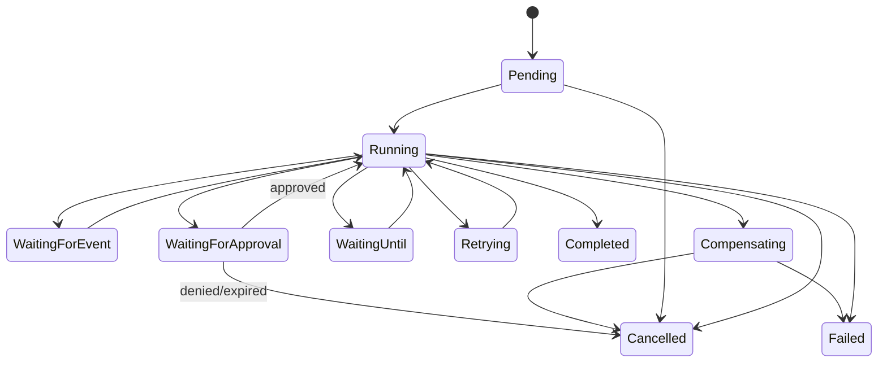

# Events, Scheduling, And Workflows

## Event Envelope

Every admitted event has:

```text
event_id              JARVIS UUIDv7
event_type            stable namespaced type
schema_version
occurred_at / received_at
source_type / source_id
external_event_id     when supplied
workspace_id
actor_id              when known
causation_id / correlation_id / trace_id
dedupe_key
sensitivity
payload
auth_verification     normalized evidence, never raw secret
```

Events include user messages, provider webhooks, connector changes, schedules, reminders, system health, workflow transitions, approvals, call lifecycle, and internal domain events.

## Admission

Ingress performs authentication/signature verification, timestamp/replay checks, schema validation, size limits, workspace resolution, dedupe, and durable persistence before acknowledging. Heavy parsing, model calls, connector calls, and workflows run asynchronously after admission.

Webhook endpoints never trust a workspace or user ID from an unsigned payload field. Provider-specific evidence is retained in a bounded redacted form.

## Inbox And Outbox

V1 uses database-backed inbox/outbox records and Tokio wakeups.

- Inbox uniqueness prevents repeated provider deliveries from creating duplicate domain events.
- Outbox insertion shares the transaction with the state change that caused it.
- Workers lease rows, heartbeat long attempts, retry transient failures, and dead-letter exhausted work.
- Delivery is at least once; handlers must be idempotent.
- Operators can inspect, replay, quarantine, or discard with an audit receipt.

Tokio channels reduce latency but are never the durable source of pending work.

## Scheduler

Schedules support one-time timestamps, intervals, calendar rules, and cron-like expressions. Store the user's IANA timezone and the policy for ambiguous/nonexistent daylight-saving times. Persist calculated next-run time and the scheduler version that produced it.

A missed-run policy is explicit: skip, run once, or bounded catch-up. Clock changes and long downtime cannot create an unbounded execution storm.

## Workflow Model



A workflow definition is versioned. An active run remains bound to the definition version it started with unless a tested migration explicitly changes it.

## Step Semantics

Each step declares:

- stable ID and implementation version
- inputs/outputs and schema
- dependencies and condition
- timeout and retry classification
- effect and idempotency semantics
- required capabilities/policy
- compensation metadata when possible
- persistence boundary

Model calls and external APIs execute as activities/steps outside deterministic state transitions. Record attempts independently from logical step state.

Parallel branches may complete in any order; joins define deterministic merge rules. Never depend on wall-clock completion order for business semantics.

## Approval Waits

An approval stores the exact normalized intent hash, display summary, effect/risk, policy version, eligible approvers, expiry, and run/step version. On approval, execution revalidates current identity, policy, connector/account health, target state, and intent hash. Approval is not a permanent bearer token.

## Cancellation And Compensation

Cancellation is cooperative until a configured escalation boundary. It prevents new steps, signals active adapters, and records whether external effects may already have happened.

Compensation is a new explicit effect, not time travel. It has its own policy, approval, failure, and audit records. If an effect has no reliable compensation, the tool definition says so.

## Proactive Engine

Proactive behavior is a policy layer over events and workflows, not an unbounded heartbeat prompt. It considers:

- user opt-in and per-topic/channel controls
- urgency and confidence
- quiet hours and timezone
- frequency and cost budgets
- duplicate/recently-dismissed suggestions
- whether action or notification is reversible
- sensitivity of context and destination

Prefer preparing a briefing or draft over taking an external action. A proactive suggestion records which events and memories caused it.

## Native First, Temporal Later

The native engine is sufficient while one daemon/database can own workflows. Preserve a `WorkflowEngine` port so Temporal can later implement high-scale, multi-worker, long-duration orchestration.

Adopt Temporal only after evidence such as worker fleet complexity, very large timer counts, cross-service ownership, or operational guarantees that exceed the native engine. A Temporal adapter still leaves JARVIS policy, memory, tools, and user identity canonical. Non-deterministic model/API operations belong in Temporal Activities, not Workflow code.

## Recovery Tests

The workflow test harness must kill/restart execution at every state transition and around every effect boundary. Required cases include duplicate event delivery, lease expiry, worker crash after provider acceptance, approval during downtime, schedule catch-up, cancellation races, retry exhaustion, and compensation failure.