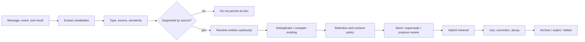

# Memory And Context

## Principles

- Chat history is not the complete memory system.
- Canonical memory belongs to JARVIS, not a model, runtime, vector database, or voice provider.
- A memory is a sourced claim with lifecycle metadata, not an unqualified string.
- Retrieval is a policy-controlled ranking problem; embeddings are one signal.
- Users can inspect, correct, supersede, export, expire, archive, and delete memories.
- Workspace and sensitivity boundaries are applied before relevance ranking.

## Memory Types

| Type | Purpose | Typical lifetime |
| --- | --- | --- |
| Working | current objective, plan, observations, pending calls | one run/workflow |
| Conversation | current dialogue continuity and summaries | session retention policy |
| Episodic | what happened and when | long-lived, decay/retention aware |
| Semantic | durable facts and concepts | until corrected, expired, or deleted |
| Preference | how the user wants things presented or done | long-lived, user-editable |
| Relationship | people/organizations and user-specific relationship context | long-lived, sensitive |
| Procedural | reusable ways of carrying out a task | versioned and reviewable |

Runtime checkpoints and provider conversation IDs are not memory types. They are opaque execution bindings.

## Canonical Record

A durable memory record includes at least:

```text
memory_id
workspace_id
subject_entity_id
type
content
structured_claim
source_kind
source_id
source_excerpt_hash
confidence
importance
sensitivity
status
valid_from / valid_until
created_at / updated_at / last_accessed_at
supersedes_memory_id
created_by_actor_id
embedding_model / embedding_dimensions / embedding_version
```

`content` is useful text; `structured_claim` holds normalized subject/predicate/object or typed preference fields when available. The original source remains separately addressable. Hashes do not replace source retention rules.

## Admission Lifecycle



The model may propose candidates, labels, confidence, and entities. Deterministic code validates shape, source linkage, workspace, size, sensitivity, and retention. High-impact identity, medical, financial, authentication, and relationship inferences require explicit user confirmation before becoming trusted facts.

## Provenance And Trust

Sources have origin and trust classes, for example:

- explicit user statement
- user correction/confirmation
- authenticated provider record
- deterministic tool observation
- imported document
- model inference
- external untrusted content

Trust is not a single global score. A provider may be authoritative for an event timestamp but not for a person's preference. Retrieval returns provenance and confidence so the context engine can phrase uncertainty correctly.

Never overwrite contradictory memory silently. Create a new claim, link `supersedes`, retain the correction trail according to policy, and stop retrieving obsolete claims as current truth.

## Entity Resolution

Canonical entity kinds begin with person, organization, project, document, account, device, location, event, task, and conversation.

Resolution uses verified provider IDs, exact identifiers, user confirmation, and probabilistic matches. Ambiguous aliases remain separate candidates. Never merge solely because embeddings are similar. A merge operation is auditable and reversible.

## Retrieval

Retrieval has two stages.

### Eligibility

Filter before ranking by:

- actor authorization
- workspace and sharing policy
- status/validity/retention
- sensitivity and destination model policy
- memory type allowed for the use case
- source trust minimum

### Ranking

Combine independently inspectable signals:

- exact identifiers and aliases
- full-text/keyword match
- semantic similarity
- entity/relationship overlap
- recency and temporal relevance
- importance
- active project/task relevance
- source reliability
- reinforcement and prior useful retrieval

No single signal may dominate by accident. Store component scores and the final inclusion reason. Diversify results across memory types/entities and enforce per-source/per-category budgets.

## Context Assembly

Context sources include identity policy, workspace policy, current input, recent conversation, active run/workflow state, relevant memories, documents, events, tool observations, and runtime-specific instructions.

Every context item has:

```text
source reference
trust/origin
sensitivity
priority
token estimate
inclusion reason
allowed destinations
quoted/untrusted flag
```

The executable form is `jarvis_core::{ContextItem, ContextTrust, ContextSourceKind,
InclusionReason, ContextBudget, assemble_context}` in `crates/jarvis-core/src/context.rs`.
Two of these fields are enforced rather than recorded, because recording them would depend
on every call site reading them correctly:

- **Only `Authoritative` content is instruction-bearing.** It is the one trust class that
  may instruct the model; user input, deterministic derivations, and external content are
  reasoning input. A source kind declares which trust classes it may carry, so external
  content labelled as policy is rejected at construction rather than at the assembly step.
- **Untrusted content must be marked quoted, and required content must be trusted.** The
  reserved budget is what protects policy from being crowded out, so admitting untrusted
  content to it would be the injection path. It is closed when the item is built.

`assemble_context` returns a manifest that accounts for every offered item as either
included or excluded-with-reason. An absent item and an item dropped for budget are
otherwise indistinguishable in the result, and only one of them is safe to reason about.
Required content that does not fit is an **error**, not an exclusion: dropping policy text
silently would leave the model operating without the constraints it is meant to follow.
The manifest reports instruction tokens and externally-originated tokens separately, since
the first bounds what could steer the model and the second bounds how much
attacker-influenced text was present.

The destination argument is the **most sensitive content the destination may receive**, not
a label for where the request is going. `Sensitivity::Restricted` as a ceiling means the
destination accepts anything (local execution); `Sensitivity::Internal` means a third-party
model that may not receive confidential or restricted content. Phrasing it as a ceiling is
what makes `Sensitivity::can_flow_to` the entire check, so a caller cannot widen what is
permitted by relabelling the destination.

Assembly order:

1. Reserve budget for immutable policy and current user intent.
2. Add required active-state and tool-contract context.
3. Retrieve eligible memory/documents within per-source budgets.
4. Deduplicate and resolve contradictions.
5. Mark external content as untrusted data and isolate instructions found inside it.
6. Compact or summarize only with source links and loss metadata.
7. Persist a context manifest, not necessarily the complete sensitive prompt, according to audit policy.

The user can ask why something was remembered or used. JARVIS should answer from stored provenance and selection reasons, not generate an explanation after the fact.

## Provider And Runtime Boundaries

- Provider chat history can reduce API payloads but is a cache/binding.
- OpenClaw, OpenAI Agents, LangGraph, and other runtimes may keep native checkpoint state.
- Before runtime invocation, JARVIS supplies only policy-eligible context.
- After runtime completion, JARVIS ingests only explicit normalized memory candidates.
- Deleting canonical memory also invalidates derived embeddings and caches; provider-side deletion requirements are surfaced separately.

## Privacy And Retention

- Local mode keeps memory local unless a configured model/tool receives selected context.
- Each memory type has configurable retention and export behavior.
- Sensitive memories can be excluded from remote models.
- Deletion covers source links where owned, embeddings, full-text indexes, caches, and relation edges.
- Audit records retain minimal decision metadata when legally/operationally required and must not preserve deleted content accidentally.
- Backup retention and provider copies are explained during deletion.

## Acceptance Invariants

- A confirmed preference survives restart with provenance.
- Correcting it removes the old claim from current retrieval while retaining an allowed audit trail.
- Deleting it removes text and derived indexes.
- An inferred preference never appears as confirmed fact.
- Client A memory cannot enter Client B context.
- Prompt injection in a retrieved email cannot alter policy or tool grants.
- Retrieval explanations reproduce the recorded scoring/inclusion facts.