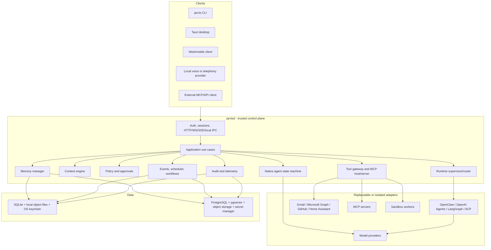
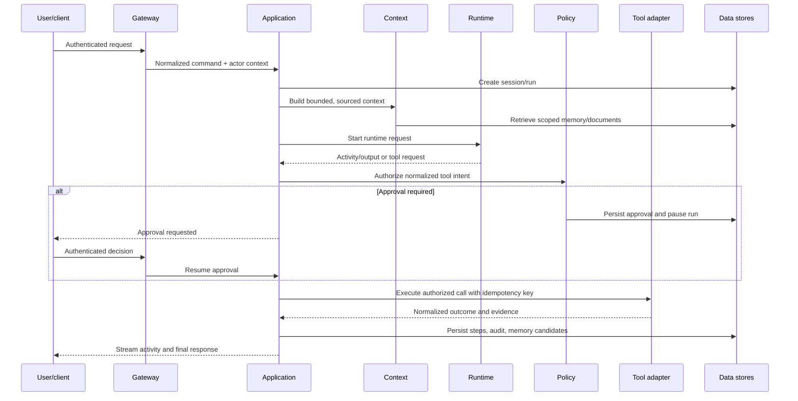
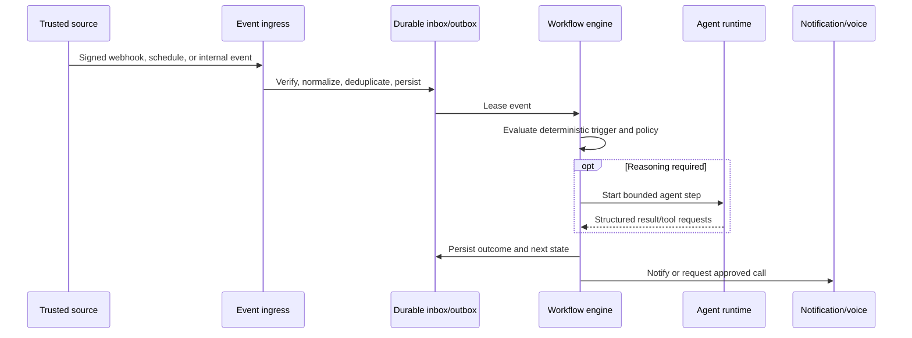

# Architecture Overview

## Decision Summary

JARVIS is a native daemon with multiple clients. Rust owns durable orchestration and authority. External models, agent runtimes, voice systems, tools, and databases connect through explicit ports.

The architecture optimizes for five properties:

1. **User authority:** the model cannot grant itself permission.
2. **Replaceability:** no provider or agent framework becomes the platform.
3. **Durability:** accepted work has an identity and recoverable state.
4. **Local-first installation:** one native install can run with SQLite and no infrastructure fleet.
5. **Inspectable behavior:** users and operators can see sources, decisions, effects, and outcomes.

## Process Topology

`jarvisd` is a trust boundary, not just a web server. Every client is authenticated according to its transport. The desktop app is not implicitly trusted merely because it runs on the same machine.

## Component Ownership

| Component | Owns | Must not own |
| --- | --- | --- |
| Gateway | client auth, request validation, protocol adaptation, streams | business policy, provider types |
| Application | use-case sequencing, transactions, state transitions | HTTP details, SQL queries, SDK payloads |
| Domain core | identities, entities, policies, state machines, ports, invariants | Axum, SQLx, Tauri, provider SDKs |
| Native runtime | think/act/observe loop and normalized run events | final authorization, raw credentials |
| Runtime manager | selection, process supervision, runtime protocol, health | canonical memory or permission ownership |
| Model gateway | provider normalization, routing, usage, retry classification | agent framework state, tool authorization |
| Tool gateway | registry, validation, grants, policy, approvals, execution, outcomes | model reasoning strategy |
| Connector manager | account lifecycle, OAuth, sync/webhooks, provider operations | cross-provider policy |
| Memory manager | admission, provenance, retrieval, correction, retention, deletion | provider-owned chat history as truth |
| Workflow engine | durable steps, waits, retries, schedules, event triggers | model calls or APIs inside deterministic transitions |
| Voice gateway | call/session mapping and provider adaptation | canonical identity, memory, or tool authority |
| Storage adapters | migrations, transactions, queries, indexes | domain decisions |

## Interactive Request Flow

The runtime never receives a credential. It receives tool descriptions and scoped handles. A tool request returns to the application and policy layers before any effect occurs.

## Proactive Event Flow

## Deployment Profiles

### Local personal

- one `jarvisd` per profile
- SQLite with write-ahead logging and local object directory
- OS keychain for secret material
- Unix socket or Windows named pipe for local clients
- loopback HTTP only when needed by browser, OAuth, MCP HTTP, or voice callbacks
- per-user service, never machine-wide by default

### Server

- stateless API replicas only after ownership/locking semantics exist
- PostgreSQL plus pgvector as canonical data store
- object storage for artifacts and optional recordings
- external secret manager
- TLS, explicit trusted-proxy configuration, backups, restore drills, and rate limits

### Portable

- foreground daemon and explicit data directory
- no service registration or global writes
- suitable for evaluation and removable media, with a warning when the directory lacks secure permissions

## Failure Model

- Persist intent before effect and outcome after effect.
- Assume network responses can be lost after a provider accepted an action.
- Distinguish `failed` from `unknown`; never retry an unknown non-idempotent effect automatically.
- Use leases and fencing/optimistic versions for workers.
- Make inbound events at-least-once and handlers idempotent.
- Resume only at explicit persisted boundaries.
- A dead optional adapter degrades a capability; it does not corrupt core state or stop unrelated capabilities.

## Evolution Rules

- Add infrastructure after a measured bottleneck, not in anticipation of one.
- Add a crate when it enforces an ownership boundary, not merely to shorten a file.
- Keep public protocols narrower and more stable than internal events.
- Use adapters for provider quirks; do not generalize a one-provider anomaly into every domain type.
- Record material changes as ADRs and retain migration compatibility tests.