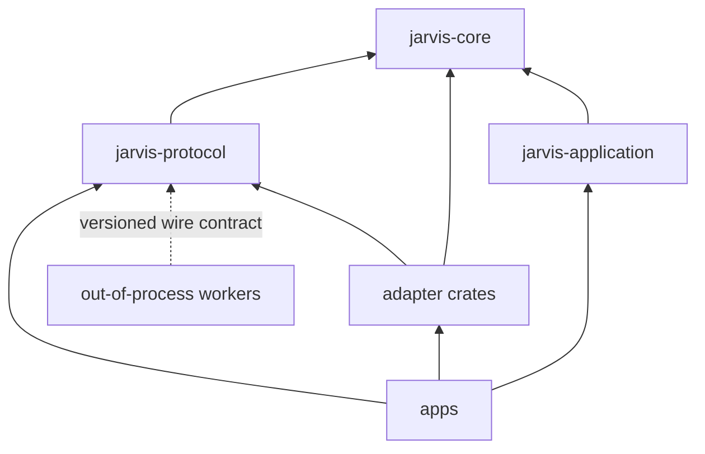

# Repository Layout

## Target Tree

Create this tree incrementally. Phase 1 begins with only the six members named in `P1-001`; later crates appear when their behavior is implemented.

Implemented so far beyond the initial six: `crates/jarvis-observability` (structured logging, redaction, and the readers behind `jarvis logs`), `crates/jarvis-diagnostics` (offline `doctor` checks, stable findings, and verified repair), `crates/jarvis-models` (provider-neutral model contracts plus one OpenAI-compatible adapter), `crates/jarvis-mcp` (MCP server identity, canonical tool naming, and schema conformance), `crates/jarvis-mcp-transport` (the MCP SDK dependency, `server/discover` negotiation, and stdio/Streamable-HTTP transports), `crates/jarvis-sandbox` (OS-level confinement contracts and the Linux cgroup-v2 backend), and `tests/e2e` (the process-level Phase 1 acceptance gate).

```text
jarvis/
|-- Cargo.toml
|-- Cargo.lock
|-- rust-toolchain.toml
|-- AGENTS.md
|-- README.md
|-- ROADMAP.md
|-- TODO.md
|
|-- apps/
|   |-- jarvisd/                 daemon composition root
|   |-- jarvis-cli/              thin local/remote API client
|   `-- jarvis-desktop/          Tauri shell; no canonical business state
|
|-- crates/
|   |-- jarvis-core/             domain types, state machines, policy, ports
|   |-- jarvis-application/      commands, queries, transactions, orchestration
|   |-- jarvis-protocol/         versioned API/runtime/event DTOs and codecs
|   |-- jarvis-storage/          SQLite/Postgres repositories and migrations
|   |-- jarvis-models/           model gateway and provider adapters
|   |-- jarvis-mcp/              MCP identity, canonical tool naming, schema conformance
|   |-- jarvis-mcp-transport/    MCP SDK adapter: discovery negotiation and wire transports
|   |-- jarvis-runtimes/         runtime router, supervisor, adapters
|   |-- jarvis-tools/            registry, policy pipeline, MCP, sandbox ports
|   |-- jarvis-sandbox/          OS process confinement: contracts and the cgroup-v2 backend
|   |-- jarvis-connectors/       first-party service connectors and OAuth
|   |-- jarvis-memory/           admission, retrieval, entity resolution
|   |-- jarvis-workflows/        durable events, schedules, workflow workers
|   |-- jarvis-voice/            voice/call contracts and provider adapters
|   `-- jarvis-observability/    tracing, metrics, audit sinks, redaction
|
|-- runtimes/                    out-of-process runtime workers
|   |-- openclaw/
|   |-- openai-agents/
|   |-- langgraph/
|   `-- examples/
|
|-- extensions/                  separately packaged process/WASI/MCP extensions
|   |-- manifests/
|   `-- examples/
|
|-- ui/
|   `-- web/                     React/TypeScript client shared with desktop
|
|-- migrations/
|   |-- sqlite/
|   `-- postgres/
|
|-- installers/
|   |-- install.sh
|   |-- install.ps1
|   `-- service/                 systemd, launchd, Windows templates/helpers
|
|-- deploy/
|   |-- docker/
|   `-- compose/
|
|-- docs/
|   |-- adr/
|   |-- api/
|   |-- architecture/
|   |-- data/
|   |-- development/
|   |-- migration/
|   |-- operations/
|   |-- product/
|   |-- quality/
|   `-- research/
|
|-- tests/
|   |-- contract/
|   |-- e2e/
|   |-- fixtures/
|   `-- platform/
|
`-- example/                     quarantined Python behavior reference
```

## Application Ownership

### `apps/jarvisd`

The production composition root. It loads configuration, constructs adapters, runs migrations, starts workers and network listeners, exposes health, and coordinates graceful shutdown. Its handlers translate protocols into application commands and queries. They do not implement policy or workflows.

It is the **only** place the pieces are joined, which is why it holds the joins that no library crate may
state. `tool_pipeline.rs` sequences the gates and composes the adapters; `dispatch.rs` resolves a canonical
tool identifier to the single adapter that runs it, refusing an uncovered tool at startup rather than after
policy has authorized it; `mcp_host.rs` reads `mcp-servers.toml`, connects the host, and holds its
connections for the process's life; `tool_actor.rs` describes the actor for the tool areas the profile
actually grants. Each of those is a **decision about failure** rather than plumbing: an MCP failure removes
tools, while a registry or filesystem-grant failure refuses to start.

### `apps/jarvis-cli`

Parses commands, discovers the daemon, authenticates, sends protocol requests, renders results, and maps machine-readable errors to exit codes. Direct database or provider access is forbidden.

### `apps/jarvis-desktop`

Owns native window/tray/update integration and a narrowly allowed bridge to the same daemon API used by other clients. React code lives in `ui/web`; Tauri-specific Rust remains in this app. The desktop process may help start or locate the daemon but does not become a second control plane.

## Crate Ownership

### `jarvis-core`

Owns stable vocabulary and invariants:

- typed IDs and actor/workspace identities
- run, approval, tool, memory, event, workflow, and call state machines
- policy decisions and reason codes
- repository and service ports expressed in JARVIS types
- domain errors

Allowed dependencies should remain small and provider-neutral. No Axum, SQLx, Tauri, MCP SDK, or vendor SDK.

**`testkit` is the one testing helper the whole workspace shares, and its two rules are about *invisible*
mistakes** (`P3-013`). `scratch_tag()` returns a `UUIDv7` so a scratch directory name cannot repeat across runs —
a pid and a resetting counter can, which let a killed run's directory be reopened and produced
`UNIQUE constraint failed` in a whole suite. `remove_scratch_dir` removes a scratch directory **by retrying on a
detached thread**, because a guard's `Drop` cannot await and the handle `sqlx` holds is released late and
off-thread: a plain `remove_dir_all` in `Drop` fails with a Windows sharing violation and the `let _ =` swallows
it, which left **124** directories per suite run and was invisible because every test still passed. Two tempting
fixes are worse and are recorded in `docs/development/testing.md`: a blocking retry starves the runtime that
releases the handle, and awaiting a close on a fresh runtime inside a worker thread **deadlocks**. A source scan
in the same module keeps future fixtures from reverting to the bare call — no assertion can observe a directory
*not* leaking without measuring the filesystem around a whole suite.

### `jarvis-application`

Owns use cases and transaction boundaries:

- start/resume/cancel run
- build context
- request/resolve approval
- execute a normalized tool
- admit/dispatch an event
- advance a workflow
- create/correct/delete memory

It depends on core ports and uses injected adapters. It emits protocol-neutral application events.

### `jarvis-protocol`

Owns externally versioned wire contracts and conversions:

- local daemon RPC
- REST/OpenAPI DTOs
- WebSocket/SSE events
- runtime worker protocol
- webhook envelope versions

It does not own business decisions. Generate TypeScript clients from its published API schema where practical.

### Adapter crates

- `jarvis-storage`: SQLx pools, repositories, migrations, backup primitives, search indexes.
- `jarvis-models`: provider clients, capability discovery, streaming normalization, usage and errors.
- `jarvis-runtimes`: runtime selection, process lifecycle, protocol sessions, health and adapter implementations.
- `jarvis-tools`: canonical registry, schema checks, execution pipeline, sandbox adapters.
- `jarvis-sandbox`: the sandbox **contract** (`Guarantee`, `SandboxPolicy`, `SandboxBackend`) and one real
  backend. It is separate from `jarvis-tools` because a guarantee is an OS-level capability rather than a tool
  concern, and because the answer differs per host: `backend_for_host()` probes the running machine, reports an
  **empty** support set where no primitive is available, and refuses any policy that requires what it cannot
  enforce. `jarvis-diagnostics` is the first consumer, reporting the guarantees in force (ADR-0041).
- `jarvis-mcp`: MCP-specific translation — server identity, canonical tool naming, tool posture,
  schema conformance, and multi-server catalog aggregation (ADR-0024, ADR-0025). Split out of
  `jarvis-tools` deliberately: `jarvis-tools` is
  the **provider-neutral** canonical contract, and this crate is where one external protocol's rules are
  reconciled with it. Keeping the reconciliation in its own crate means the canonical contract stays
  free of protocol quirks, and the MCP wire transport (`P3-008`) has a home that is neither the domain
  contract nor the daemon. It depends only on `jarvis-core` and `jarvis-tools`, and holds **no
  transport**: the JSON-RPC framing, stdio supervision, and HTTP header mirroring are `P3-008`, so the
  authority rules are testable without a peer. `McpCatalog` aggregates several servers and **reports** a
  cross-server name collision rather than resolving it, because a winner chosen by configuration order
  would make the reachable tool set depend on an ordering nobody declared meaningful; for the same reason
  it refuses two listings for one server and records a changed server self-description as an
  `IdentityDrift` instead of treating it as an error.

  **`ServerExposure` is this crate's server-side half** (`P3-009a`): the origin allowlist JARVIS will serve
  a browser from, as a **pure value** rather than the SDK's server configuration. It exists because reading
  `rmcp`'s server transport showed its `Default` is permissive on the specification's MUSTs — an empty
  `allowed_origins` disables `Origin` validation entirely, `legacy_session_mode` mints a session the
  revision removed, and an absent `MCP-Protocol-Version` is treated as `2025-03-26`. The comparison is also
  ours rather than the SDK's, because `origin_is_allowed` makes a portless entry a wildcard over every port
  while treating an explicit default port as literal — so it can neither express the intended control nor
  match ordinary browser traffic. **A default is the one value that changes without a line in this
  repository changing**, which is why the policy is stated here and mapped onto the SDK's fields in
  `P3-009b` rather than inherited (ADR-0031).

  **`served_tools` is the other half of the inbound question** (`P3-009d`): *which* of our tools may a remote
  client call, as opposed to from where. It does not reuse `McpCatalog`, because the rules run the opposite
  way — outbound an operator names a server and a posture is declared about a third party, while inbound the
  name is the **canonical identifier transmitted verbatim** and the question is whether the source is code
  this project wrote. A tool whose source is third-party code is therefore **refused and named rather than
  re-exposed**: our origin allowlist, loopback bind, and audit trail describe *this daemon*, and a nested
  call would reach a third party's tool that our policy never classified, under a posture written for our own
  use of it. Nested exposure is deliberately not built rather than built as a side effect (ADR-0032).

  **`JarvisMcpServer` is the crate's server half** (`P3-009e`), and its central property is that
  **filtering `tools/list` is not authorization**. An MCP client may call any name whether or not it was
  advertised, so the handler holds the served set and refuses an unserved name **before the runner is
  consulted** — a catalogue is not a control, and the difference is pinned by a test whose runner panics if
  it is reached. Both SDK server defaults are overridden by naming one revision, because
  `ProtocolVersion::default()` is `LATEST` = the **legacy** `2025-11-25` and `supported_protocol_versions`
  defaults to every version the SDK knows. The runner is a **port** (`ServedToolRunner`) rather than the
  pipeline, so a remote call's attribution stays the daemon's and the refusal rule is testable with no
  daemon (ADR-0033). Nothing is bound: there is no listener, so this is a handler a test can drive and not
  yet a server a client can reach.

  **`ServingConfig` is the configuration a client would be served under, and it exists because a delegated
  check that cannot express the rule is not a control** (`P3-009b`). The SDK's origin validation compares
  against `allowed_origins` directly with **no extension point**, so the comparison this project needs cannot
  be substituted — therefore the SDK's check is disabled, with the reason recorded, and JARVIS's policy is the
  decision. Enabling both would be worse: two rules that disagree about a portless entry, one of them a
  wildcard, and a populated `allowed_origins` that reads as the control. Every other permissive SDK default is
  a stated value, and a test reads the SDK's own `Default` alongside it so an upgrade cannot change the policy
  silently. A configuration allowing a **public** origin is refused outright, because serving off-host needs
  audience-bound tokens that are not built (ADR-0034). Binding a socket remains the daemon's, because network
  listeners belong to the composition root.

  **`CallerAdmission` is the inbound mirror of this crate's oldest rule** (`P3-009g`): the allowlist's subject
  is a **credential fingerprint**, and a client's `clientInfo` is recorded as evidence and never consulted to
  permit. `clientInfo` is `{name, title, version, …}`, entirely client-chosen and unverified, so keying an
  allowlist on it would let a caller send `name = "vscode"` and be admitted **as VS Code** — ADR-0024's defect
  on the inbound side, where the label decides permission rather than identity (ADR-0036). A label mismatch is
  **reported, never refused**, because the fingerprint already admitted the caller and refusing would make the
  label a second permit. Rate limiting is a **bound** here (the daemon counts), because a policy that mutates
  per request cannot be compared or reused.

  **`RequestGate` is where both inbound decisions are applied to one request, and an admitted request is a
  type** (`P3-009i`). Every slice above recorded "a policy value nothing enforces", and a pair of checks has an
  order whether or not anyone chose it, so the gate states both: `Origin` **first**, because the revision makes
  `Origin` validation unconditional, which means a request failing **both** is reported as an origin refusal
  (a `403`, the remedy a browser can act on) rather than as a `401` that tells the caller about its credential
  while the origin went unexamined. `RequestAdmission` has **private fields and no public constructor**, so the
  only way to hold one is the gate returning `Ok` — a `bool` would carry the information and none of the
  guarantee, since `true` is also what a default-initialized field holds (ADR-0037). The gate takes **values,
  never a request**: it cannot read a `HeaderMap` without a listener to produce one, and deriving those values
  is the daemon's because the listener is. A `ServingConfig` and a `CallerAdmission` that look inconsistent
  (loopback-only serving beside an allowlist with remote entries) are **not** reconciled, because the bind is
  one control and the admission policy another, and a control that depends on another having worked is not a
  control.

  **`ServedEndpoint` is the layer a listener mounts, and a network request is never a local caller**
  (`P3-009c-a`). It is a `tower` service wrapping the SDK's Streamable HTTP service rather than a route handler,
  because that service **is** a `Service<Request<Body>>` — so the wrap is one `impl Service` instead of a second
  routing layer and a second body type, and `axum::Router::fallback_service` accepts any `Service`. It derives
  the gate's four values from a real request and answers `RequestRefusal::refusal_status`, which is where
  "nothing binds" ends. `CallerOrigin::Remote` is **hard-coded**, and that is the slice's central decision:
  `Local` means the operator on their own machine, established by the daemon's *transport* (a named pipe, a
  socket it holds), and a loopback bind is not that evidence because any local process and a browser on the same
  machine can reach `127.0.0.1` — deriving it from a peer address would be `CallerOrigin`'s own defect one layer
  down. An oversized `Origin` is **truncated, never treated as absent**, because absent is *admitted* by the
  spec's own rule, so collapsing it into `None` inverts the control. `into_service` returns `impl Service`,
  keeping the SDK's service out of this crate's contract, while `ResponseBody` is public — a fact about
  `http-body-util` rather than about MCP, which is why naming it is not a leak (ADR-0038).

  **`jarvisd` mounts it, and a remote call is a second entrypoint into the tool path** (`P3-009c-b`). The
  composition root owns the listener because it owns every network listener: `compose_serving_mcp` builds the
  endpoint over the already-composed pipeline and `ServingMcp` binds loopback on `mcp_serve_port`, a field
  **separate** from `http_enabled` because the two listeners have different trust boundaries and different
  answers to "who may call". A remote call reaches `ToolPipeline::call_remote_tool`, whose whole reason to exist
  rather than a `record: bool` on `call_tool` is that "may this call write a row" must be a property of *which
  function was called* and not an argument a caller can set wrongly. It writes **no `tool_calls` row**, and the
  authority is the schema: `0007_tool_calls.sql` declares `run_id TEXT NOT NULL REFERENCES agent_runs (id)`, so a
  call with no run **cannot be stored** — inventing a run identifier is refused by the foreign key rather than by
  a comment. Parity is achieved by calling the same `validate`, the same `evaluate`, and the same dispatcher, and
  the only differences are the audit record and the approval outcome: an approval is **refused, not bypassed**,
  by two independent checks (the engine's workspace threshold and the tool's own `ApprovalPolicy` declaration),
  because there is no run to park a held decision in and running it is the unsafe direction. `map_pipeline_error`
  propagates an adapter's own error **unchanged** so `AdapterError`'s three-way claim survives — collapsing
  `AmbiguousAfterReaching` into `RefusedBeforeReaching` would tell a client to retry an unknown-effect call, and
  for a non-idempotent tool that retry is a second effect. `into_service` pins `Future = ResponseFuture` with
  `Clone + Send + Sync + 'static`, because an opaque `impl Service` says nothing about `Service::Future` being
  `Send` and the omission otherwise surfaces at the **mount site** (ADR-0039).

  **`conformance.rs` measures this server against the protocol, not against the SDK** (`P3-010`), and the
  distinction is the whole point: the defect it found *is* an `rmcp` default. `$defs.ListToolsResult` declares
  `"required": ["cacheScope", "resultType", "tools", "ttlMs"]`, and `with_all_items` leaves two of those unset
  **deliberately — for multi-era compatibility**, which is correct for a server serving several eras and wrong
  for one that advertises a single revision. A vendored **derived** slice of the official schema lives at
  `tests/spec/` (11 definitions by reference closure, not hand-picked), and `jsonschema` — a validator with no
  MCP knowledge — checks the document the server actually emits, so three layers share no assumption. The
  construction is extracted into `tools_list_result` because the first version of the test assembled its own
  JSON and therefore kept passing after the builder call was removed (ADR-0040).
- `jarvis-mcp-transport`: the **impure** half of the MCP integration — the SDK dependency, the
  `server/discover` negotiation, the stdio/Streamable-HTTP transports, `tools/call`, the host join, and
  the `ToolExecutor` adapter (`P3-008e`..`P3-008h`). Separate from `jarvis-mcp` because that crate's value
  is that it is pure: the authority rules are verified as functions of their arguments, with no SDK type in
  scope and no peer standing. Adopting `rmcp` beside them would make a security reviewer read the rules
  through a third-party data model, and would make the rules untestable without it. The split also keeps
  the SDK replaceable: if the transport is reimplemented against the wire, no naming, posture, or
  conformance rule moves. **No provider SDK type appears in this crate's public surface, with one recorded
exception** — `AGENTS.md` forbids SDK types crossing a JARVIS boundary, and an error type is a boundary. The
exception is `connect_over`, whose signature names `IntoTransport` and `RoleClient` because the negotiation
tests drive the real SDK over an in-process duplex pair, and `P3-007` recorded that a fixture sharing the
code's assumptions cannot find a revision defect. **Writing the boundary test is what revealed this**: the
claim was already false before `P3-008b`, so the sentence now names the exception and
`boundary_tests.rs` pins the list — a new name fails the test, and removing the exception is a change a
reader must make deliberately. The clean end state is an off-by-default feature gating that visibility, so
the shipped surface is SDK-free; it is recorded as a follow-up rather than half-built. `build_catalog` is the
  **join** between the two halves: it reads a live connection's identity and tool list and aggregates them
  into one `McpCatalog`, because the catalog's inputs can be constructed by hand and so a catalog test
  alone proves nothing about whether a listing that *arrived over a wire* becomes a definition with the
  right posture (ADR-0026). `McpHttpEndpoint` is a **validated** remote endpoint — scheme, credentials,
  fragment, and TLS-off-loopback are properties of the value rather than conventions at a call site — and
  this crate **builds the HTTP client** it hands to the SDK, so no-proxy and no-redirect are statements
  this project makes rather than defaults inherited from the SDK's manifest (ADR-0027). `McpToolAdapter`
  makes a remote server's tool a real `ToolExecutor`, and its **outcome mapping is the honesty boundary**:
  each row decides whether an effect may be repeated, so a transport failure after sending is
  `AmbiguousAfterReaching` rather than a refusal (ADR-0028). `McpHostConfig` is the **host role**: the
  `[mcp]` configuration surface, which owns only that section so one schema owner exists per document, and
  which is the first caller of the catalog's collision check — a collision refuses the whole host rather than
  dropping a side, because serving a catalog whose contents depend on configuration order would make the
  reachable tool set a function of an ordering nobody declared meaningful (ADR-0029).

  **The daemon now reads a document this crate owns, and that is what makes an MCP server an
  operator-reachable tool.** `apps/jarvisd/src/mcp_host.rs` loads `mcp-servers.toml` (a separate document
  from `config.toml`, because a third-party server that is missing, hung, or colliding must remove the MCP
  *tools* rather than stop the daemon — the daemon's schema also validates by key allowlist, so an `[mcp]`
  section would make a storage adapter learn one protocol's vocabulary). `apps/jarvisd/src/dispatch.rs` is
  the table that resolves a canonical identifier to the one adapter that runs it, built from each adapter's
  own definitions and refusing both a tool no adapter covers and a tool two adapters claim. Ten slices
  recorded "a capability a caller can use, not one an operator can reach"; this is the one that ends it
  (ADR-0030).
- `jarvis-connectors`: OAuth/account lifecycle and provider-specific mail/calendar/etc. operations.
- `jarvis-memory`: memory admission, scoring, embeddings, retrieval explanations, entity resolution.
- `jarvis-workflows`: event inbox/outbox, scheduler, durable worker and step executors.
- `jarvis-voice`: voice session/call normalization, ElevenLabs and future provider adapters.
- `jarvis-observability`: tracing setup, metrics, audit sinks and shared redaction.

If two adapter areas share only a small DTO, keep the DTO in core/protocol rather than creating a generic utilities crate.

## External Workers

`runtimes/<name>` contains independently runnable workers and their language-native dependency files. Each worker implements a released JARVIS runtime protocol version and has contract fixtures. It cannot link to private Rust internals.

`extensions/` is for separately distributed capability providers. Prefer MCP, versioned HTTP/stdio, or WASI. Native dynamic libraries are not the default extension ABI.

## Integration Package Shape

A first-party connector module should use a predictable shape:

```text
crates/jarvis-connectors/src/google/
|-- manifest.rs       static metadata, scopes, operations, docs links
|-- auth.rs           OAuth flow and token lifecycle
|-- client.rs         provider HTTP client and normalized errors
|-- gmail.rs          mail operations
|-- calendar.rs       calendar operations
|-- webhook.rs        verified ingress and dedupe identity
|-- diagnostics.rs    redacted health evidence
`-- tests.rs          local contract tests; live tests stay opt-in
```

Do not force this exact file count when a connector is small. Preserve the ownership categories.

## Tests And Fixtures

- Unit tests live beside the owning module.
- Cross-crate contract tests live in `tests/contract`.
- Full user journeys live in `tests/e2e`.
- OS service/install tests live in `tests/platform` and run on native disposable runners.
- Sanitized wire fixtures live in `tests/fixtures/<provider>/<version>` with provenance and capture instructions.
- Live tests are opt-in, credential-gated, cost-labelled, and never part of a normal offline unit suite.

## Dependency Direction



No arrow may point from core/application into a provider adapter. Composition happens only in binaries and test harnesses.