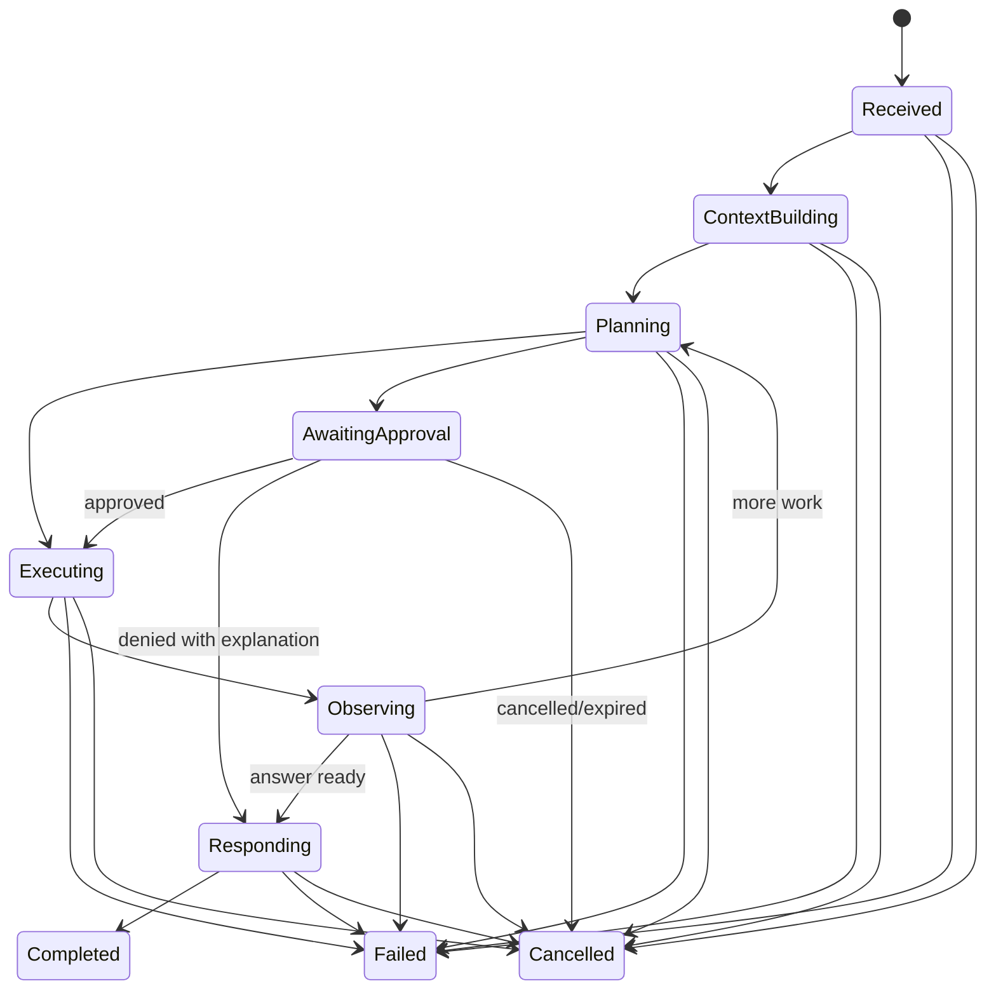

# Runtime And Model Architecture

## Three Separate Concepts

- A **provider** authenticates and transports model requests, for example OpenAI, Anthropic, Google, Ollama, or an OpenAI-compatible endpoint.
- A **model** is a selectable capability with context, modality, latency, cost, structured-output, and tool-use characteristics.
- A **runtime** controls an agent strategy: native JARVIS, OpenClaw, OpenAI Agents, LangGraph, ACP, or another worker.

A runtime may use several models. A model is not automatically a runtime. Configuration and telemetry must never collapse these identifiers.

## Native Run State Machine



Each transition has an expected state/version, persisted input, actor, timestamp, and normalized event. Illegal transitions fail without mutation.

The executable form is `jarvis_core::{RunState, RunTransition, ExpectedRunState}` in `crates/jarvis-core/src/run.rs`. Two properties of the table are load-bearing, and tests in that module assert them directly:

- **`awaiting_approval` is cancellable but not failable.** No machine work is in progress while a human decides, so there is nothing that can fail; an approval that times out is the documented `cancelled/expired` edge. Adding a `failed` edge here would let an unrelated infrastructure error settle a run that is waiting on a person.
- **`responding` can fail and can be cancelled.** Without those two edges a generation that fails mid-answer would have `completed` as its only legal successor, recording a failed answer as a success.

Terminal states are immutable: once a run is `completed`, `cancelled`, or `failed`, no further transition is legal, and a duplicate settlement is reported as terminal immutability rather than as an ordering violation.

## Domain Port

The exact Rust API will be finalized in `P7-001`, but it should preserve this shape:

```rust
#[async_trait]
pub trait AgentRuntime: Send + Sync {
    fn id(&self) -> RuntimeId;
    async fn capabilities(&self) -> Result<RuntimeCapabilities, RuntimeError>;
    async fn start(&self, request: RuntimeRequest) -> Result<RuntimeStream, RuntimeError>;
    async fn resume(
        &self,
        run: RuntimeRunId,
        input: Option<RuntimeInput>,
    ) -> Result<RuntimeStream, RuntimeError>;
    async fn cancel(&self, run: RuntimeRunId) -> Result<(), RuntimeError>;
    async fn health(&self) -> RuntimeHealth;
}
```

The port uses JARVIS IDs and normalized events. Provider SDK classes, Python objects, and runtime-native session handles stay inside adapters; JARVIS stores opaque binding data with adapter/version metadata where needed.

## Runtime Event Contract

Minimum normalized event families:

- `run.started`
- `activity.updated`
- `output.delta`
- `output.completed`
- `tool.requested`
- `input.requested`
- `checkpoint.created`
- `usage.updated`
- `artifact.created`
- `run.completed`
- `run.failed`
- `run.cancelled`

Events carry protocol version, sequence, run/runtime IDs, timestamp, correlation/trace IDs, and a sensitivity classification. Sequence gaps are observable. Unknown additive fields are tolerated within a compatible version; unknown event kinds fail the adapter session safely.

Do not expose hidden model chain-of-thought. `activity.updated` contains concise operational facts such as "Searching mail" or "Waiting for approval." Provider reasoning summaries are optional user-visible artifacts only when the provider exposes them intentionally and policy permits retention.

## External Runtime Isolation

External runtimes normally execute as child processes or remote workers.

The supervisor owns:

- executable identity and protocol-version negotiation
- sanitized environment allowlist and secret references
- startup/readiness timeout and heartbeat
- CPU, memory, process, filesystem, and network restrictions where supported
- stdout/stderr capture with bounds and redaction
- cancellation escalation and orphan cleanup
- restart backoff and circuit breaking
- native-session binding and cleanup

An external runtime must request host tools through the runtime protocol. Direct native tools are disabled unless a separate sandbox policy and audit adapter intentionally enables them. A runtime's internal memory/checkpoints may support continuation, but they are runtime state, not canonical user memory.

## Runtime Selection

Selection is deterministic policy followed by scoring:

1. Eliminate runtimes that lack required modality/capability, violate privacy/placement policy, are unhealthy, or lack a grant.
2. Apply explicit user/workspace/runtime overrides.
3. Score eligible runtimes for task class, expected quality, latency, cost, locality, resumability, and current capacity.
4. Record candidates, exclusions, selected runtime, selected model policy, and reason codes.
5. Fall back only to a runtime that preserves required safety and capability semantics.

Examples:

- simple answer: native runtime with a low-latency model
- repository coding: OpenClaw/ACP or another sandboxed coding runtime
- provider-independent structured workflow: native workflow engine
- graph-specific experiment: LangGraph worker
- private offline task: native runtime with a local model

## Model Gateway

`crates/jarvis-models` owns these contracts. The port is expressed entirely in JARVIS
types; no HTTP client, SDK, or provider response type appears in a signature.

```rust
#[async_trait]
pub trait ModelGateway: Send + Sync {
    fn provider_id(&self) -> &ProviderId;
    async fn capabilities(&self, model: &ModelId) -> Result<ModelCapabilities, ModelError>;
    async fn complete(&self, request: ChatRequest) -> Result<ChatResponse, ModelError>;
    async fn stream(&self, request: ChatRequest) -> Result<ModelStream, ModelError>;
    async fn health(&self) -> ProviderHealth;
}
```

`complete` and `stream` each perform **one** provider attempt. Retry, backoff, and
deadline policy belong to the caller, so an attempt stays independently observable and
separately recordable.

The model port normalizes:

- messages/content parts and system instructions
- image/audio/document references
- tool definitions and tool calls
- structured-output schema
- stream deltas and completion
- usage and cost dimensions
- finish reason and safety refusal
- retryability, rate limits, context overflow, auth, invalid request, and provider outage

### Fail-Closed Details

Three properties exist because the naive form of each fails open:

- **`Support` is three-valued** (`Supported`/`Unsupported`/`Unknown`). A two-valued flag
  forces an unprobed capability to be reported as supported. Callers must use
  `is_supported()`, never `!is_unsupported()`.
- **`Placement` defaults to `Unknown`, not `Local`.** Assuming local would let private
  content leave the machine on an unverified assumption.
- **`StreamValidator` rejects an unterminated stream.** A dropped connection and a
  finished response look identical to a consumer that only concatenates deltas, so
  `FinishReason::Incomplete` is synthesized and never reported as `Stop`. Sequence
  gaps, repeats, and events after a terminal event are likewise rejected.
- **Quota maps to `PermanentUpstream`, not `UnavailableCapability`.** Both official
  documentation and `ErrorCode::is_retryable()` were checked: retrying billing, spend,
  or quota errors does not restore access, and `UnavailableCapability` is a retryable
  category. `ModelErrorKind::is_retryable()` is derived from `domain_code()` so the
  retry decision and the persisted code cannot disagree.
- **A `429` is classified by its body, not its status.** It covers both a transient rate
  limit and a permanent credit exhaustion, and only the error code distinguishes them.
  Classifying by status alone would either retry a dead account or refuse a transient
  limit.

### The Adapter

`crates/jarvis-models/src/openai/` implements `ModelGateway` for the OpenAI-compatible
Chat Completions dialect. It is generic over an internal `Transport` trait, so retry,
timeout, error-mapping, and streaming behaviour is tested offline against scripted
provider bytes rather than against a live service. The default suite performs no
network I/O, and no live provider call is claimed.

Four configuration choices in the HTTP transport each correct a default that fails open
for private content:

- **Proxies disabled.** `reqwest` reads `HTTP_PROXY`/`HTTPS_PROXY`/`ALL_PROXY` from the
  environment by default, which would route a local-model prompt through an intermediary
  the user never chose.
- **Redirects not followed.** A redirect can move an `Authorization` header to another
  origin.
- **TLS verification always on.** No insecure path is offered.
- **A read timeout is set.** Without it a stalled body hangs a run indefinitely, because
  a request timeout does not bound each individual read.

Additional fail-closed properties:

- A provider `Retry-After` hint always overrides computed backoff and is not clamped to
  the local ceiling, because the provider is stating how long *it* needs.
- Provider error text is never carried into a `ModelError`; JARVIS owns the explanation
  for its own categories, so a provider message that echoes the prompt cannot leak.
- The API key is a zeroing, redacted type reachable only through `header_value()`, and
  the provider request type has no representation for the key, so a key cannot be placed
  in a URL. A pasted URL or a copied `Bearer` header is rejected as a credential.
- Streaming tool calls are not surfaced. Fragments arrive across chunks and must be
  reassembled before they mean anything; reporting one early would ask JARVIS to
  authorize a call whose arguments are incomplete.
- A health probe issues a bodyless `GET /models`, because a reachability check must not
  incur a billable completion call.

The router receives a requirement object rather than a provider name. Requirements include modality, tool/structured-output support, minimum context, locality, data policy, latency budget, cost ceiling, and quality tier.

## Retries And Effects

Model calls are generally repeatable but may incur cost. Every attempt is recorded. Retry only normalized transient classes, honor provider retry hints, cap elapsed time/attempts, and propagate cancellation.

Tool effects are not model retries. The runtime emits a tool intent; JARVIS executes it through the canonical tool pipeline with its own idempotency and ambiguity rules.

## Adapter Intent

- **OpenClaw:** use for mature agent/channel/coding behaviors through an official runtime, ACP, or gateway contract verified at implementation time.
- **OpenAI Agents:** run as a Python worker when its runner, sandbox, realtime, or specialist-agent behavior is useful.
- **LangGraph:** use as a Python worker for a named graph/checkpoint use case, not as the platform-wide workflow database.
- **ACP:** implement as a general runtime interoperability adapter.
- **Local models:** expose through the model gateway using documented OpenAI-compatible or native APIs; local does not mean trusted.

Every adapter requires a current research record, protocol fixtures, version-skew behavior, and a removal/degradation plan.