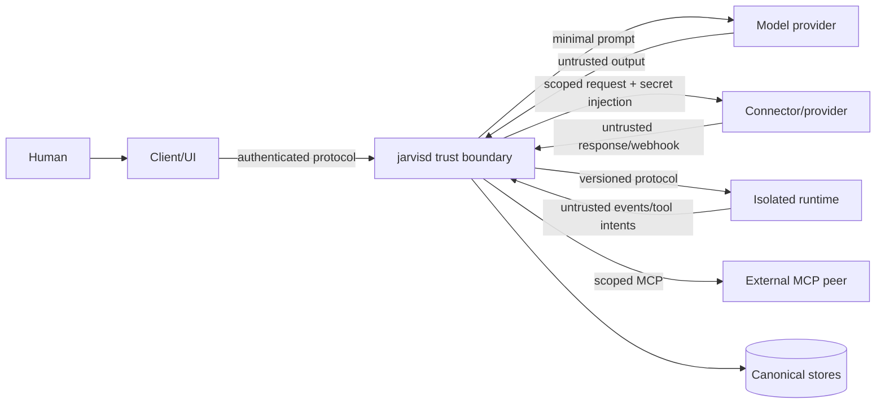

# Security Architecture And Threat Model

## Security Objective

JARVIS handles personal context and can create real-world effects. Its primary objective is to ensure that only an authenticated, authorized actor operating within explicit workspace policy can cause a bounded capability to execute, while preserving evidence and protecting secrets and personal data.

The model is untrusted input. Safety prompts improve behavior but are not controls.

## Assets

- user and workspace identity
- connector credentials and provider accounts
- memories, messages, documents, transcripts, recordings, and files
- tool authority and approval decisions
- workflow/schedule definitions and pending work
- runtime/model configuration and cost budgets
- audit history and security evidence
- signing/update keys and release artifacts
- paired device credentials

## Actors

- local owner
- authenticated workspace member
- local CLI/desktop/browser/mobile client
- external MCP/API client
- voice caller
- connector/provider webhook sender
- model provider
- external runtime/worker
- MCP server or extension
- attacker with network, local-user, dependency, content, or provider access

## Trust Boundaries

Crossing a boundary requires validation, identity, scope, limits, and observability. Network location alone is not identity.

## Data Classification

| Class | Examples | Default handling |
| --- | --- | --- |
| Public | public docs, public model catalog | normal controls |
| Internal | configuration metadata, non-sensitive activity | authenticated workspace access |
| Confidential | email, calendar, documents, memories, transcripts | encrypted transport, scoped access, redacted logs |
| Secret | tokens, keys, passwords, signing material | secret store only, never model-visible |
| Restricted | health/financial/legal data, recordings, biometric-like voice data | explicit policy, minimal retention, remote-model restrictions |

Every context item, tool input/output, artifact, event, and trace can carry a classification. Adapters may raise but not silently lower it.

## Threats And Required Controls

| Threat | Control |
| --- | --- |
| Prompt injection in email/web/docs | mark external content untrusted; isolate instructions; enforce policy outside model; minimize tools/context |
| Model self-approval/confused deputy | authenticated approval receipt bound to exact intent, actor, policy version, expiry, and state version |
| Malicious/compromised MCP server | explicit install consent; constrained process/network; schema and output bounds; per-server scopes; no inherited secrets |
| Compromised external runtime | process isolation; environment allowlist; mediated tools; protocol validation; resource limits; kill/orphan cleanup |
| Credential exfiltration | `SecretRef`; just-in-time adapter resolution; egress restrictions; structural redaction; no secrets in prompts/URLs |
| SSRF and unsafe redirects | URL parser; scheme/host/IP policy; DNS rebinding defense; redirect revalidation; block metadata/private ranges by default |
| Filesystem escape | granted roots; handle-based/race-resistant access; symlink/junction policy; path normalization; size/count limits |
| Shell/command injection | structured commands where possible; sandbox; no host shell by default; resource/network/filesystem limits |
| OAuth interception/CSRF | PKCE, state, nonce, exact redirect matching, short-lived setup transaction, verified provider account |
| Webhook spoof/replay | raw-body signature verification, timestamp window, endpoint binding, dedupe key, durable inbox |
| Cross-workspace leakage | mandatory workspace keys, repository-level filters, authorization tests, retrieval eligibility before ranking |
| Memory poisoning | provenance/trust, candidate validation, user confirmation for high-impact claims, correction/supersession |
| Duplicate external effects | intent ledger, idempotency keys, provider receipts, `unknown` reconciliation, no blind retry |
| Voice impersonation | caller evidence is not proof; restricted guest mode; second factor/trusted-device approval for sensitive actions |
| Cost/resource abuse | per-actor/client/workspace budgets, rate/concurrency limits, bounded context/output, circuit breakers |
| Supply-chain compromise | pinned toolchain/dependencies, lockfiles, provenance/SBOM, signature verification, review of build scripts |
| Malicious update/downgrade | signed artifacts, trusted root, atomic handoff, schema preflight, backup, rollback and anti-confusion checks |
| Audit leakage/tampering | content minimization, append-only receipts, integrity protection, access controls, retention limits |

## Authentication And Authorization

- Local clients use OS-protected IPC plus a profile-bound credential or equivalent peer identity.
- Remote clients use TLS and scoped, rotatable credentials; browser sessions use CSRF-resistant flows.
- Service clients use dedicated credentials, never a user's broad token.
- Pairing requires user presence/approval and binds a device public key where practical.
- Authorization evaluates actor, client, workspace, capability, connector account, resource, channel, effect, risk, and policy version.
- Deny overrides allow. Missing or stale evidence fails closed.

## Approval Security

An approval is a decision record, not a model message. It contains:

- approval ID and one-time decision nonce
- exact canonical intent hash and human-readable preview
- requesting run/step/tool/version
- actor/workspace/client and eligible approvers
- effect/risk and policy version
- creation/expiry and decision timestamps
- decision channel and authentication strength

Before effect, revalidate that the request, target, state, permissions, and connector account still match. Editing the action invalidates the approval.

Voice confirmation alone is insufficient for risk-3 actions by default. A trusted desktop/mobile/CLI approval may resume a voice-originated run.

## Secret Architecture

Use providers behind `SecretStore`:

- Windows Credential Manager
- macOS Keychain
- Linux Secret Service where available, with a clearly disclosed encrypted fallback
- environment or file references for containers
- Vault/cloud secret managers for server mode

Secret values are short-lived in memory, zeroized where practical, and passed only to the adapter operation that requires them. Do not serialize provider clients or credential-bearing request objects into run state.

## Sandbox Architecture

Sandbox policy declares image/runtime identity, user, mounts and access modes, network destinations, environment allowlist, process count, CPU, memory, disk, wall time, output, and artifact limits.

Prefer separate processes/containers/WASI. Platform-specific strong isolation differs; `doctor` reports effective guarantees rather than claiming parity. If a requested guarantee is unavailable, deny or require an explicitly weaker profile.

## Network Exposure

- Default bind is loopback/local IPC.
- Remote mode is explicit and refuses startup without authentication.
- Trusted proxy headers are accepted only from configured proxy addresses.
- CORS is deny-by-default; no wildcard with credentials.
- Browser/MCP/webhook/admin endpoints have separate scopes and rate limits.
- mDNS/discovery advertises no secret and does not grant trust.
- Production deployment prefers a private network/tailnet or authenticated reverse proxy over direct public exposure.

## Privacy And Logging

Structured logs record IDs, types, durations, status, and bounded error metadata. Prompt bodies, model output, tool payloads, email/document content, transcripts, audio, tokens, cookies, and authorization headers are excluded by default.

Tracing has a content-free default and an explicit sensitive-debug mode with short retention and warnings. Sanitized diagnostic bundles enumerate what they contain before export.

## Secure Update And Installation

- Download over TLS and verify a signed manifest plus artifact checksum/signature.
- Build on native CI from an immutable revision and publish provenance/SBOM.
- Stage updates separately, stop/handoff the daemon, preflight schema/config compatibility, activate atomically, probe health, then finalize.
- Preserve the previous binary and backup until health succeeds.
- Never execute unsigned lifecycle scripts fetched independently of the verified release.
- Install services with least privilege and explicit writable paths.

## Security Tests

Required suites include:

- policy table tests and deny precedence
- approval forgery, replay, expiry, mutation, and stale-state tests
- workspace/tenant isolation property tests
- path traversal, symlink/junction race, archive, and filename tests on every OS
- SSRF, redirects, DNS rebinding, and private-address tests
- webhook signature/timestamp/replay tests with raw body mutation
- secret redaction canaries across errors/logs/traces/URLs
- malformed runtime/MCP frames, oversized payloads, stream gaps, and crash tests
- idempotency and unknown-effect reconciliation tests
- malicious document/email prompt-injection scenarios
- installer/update tamper and rollback tests
- dependency, license, secret, and static analysis in CI

For every security guard, add a falsification test that would fail if the original unsafe behavior were restored.

## Incident Response Baseline

`jarvis security contain` is a future operator flow that should stop external effects, revoke/disable clients and connector sessions where possible, pause workflows, preserve minimal evidence, and guide credential rotation. Backups and diagnostics must not become a second exfiltration channel.

Before remote beta, create a detailed incident runbook, severity model, notification policy, key-rotation procedure, and restore rehearsal.

## Open Security Decisions

- root project license and release-signing authority
- exact Linux encrypted secret fallback
- minimum viable sandbox per OS
- remote authentication and device-pairing protocol
- audit integrity mechanism and retention defaults
- jurisdiction-specific voice disclosure/recording policy

Resolve each before the feature relying on it ships; record the result in an ADR.