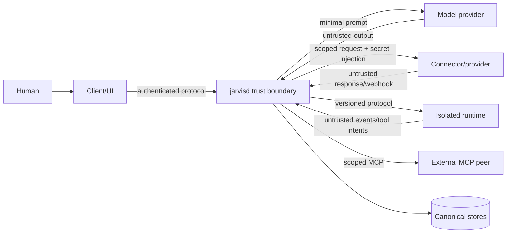

# Security Architecture And Threat Model

## Security Objective

JARVIS handles personal context and can create real-world effects. Its primary objective is to ensure that only an authenticated, authorized actor operating within explicit workspace policy can cause a bounded capability to execute, while preserving evidence and protecting secrets and personal data.

The model is untrusted input. Safety prompts improve behavior but are not controls.

## Assets

- user and workspace identity
- connector credentials and provider accounts
- memories, messages, documents, transcripts, recordings, and files
- tool authority and approval decisions
- workflow/schedule definitions and pending work
- runtime/model configuration and cost budgets
- audit history and security evidence
- signing/update keys and release artifacts
- paired device credentials

## Actors

- local owner
- authenticated workspace member
- local CLI/desktop/browser/mobile client
- external MCP/API client
- voice caller
- connector/provider webhook sender
- model provider
- external runtime/worker
- MCP server or extension
- attacker with network, local-user, dependency, content, or provider access

## Trust Boundaries

```mermaid
flowchart LR
    User[Human] --> Client[Client/UI]
    Client -->|authenticated protocol| Daemon[jarvisd trust boundary]
    Daemon -->|minimal prompt| Model[Model provider]
    Model -->|untrusted output| Daemon
    Daemon -->|scoped request + secret injection| Provider[Connector/provider]
    Provider -->|untrusted response/webhook| Daemon
    Daemon -->|versioned protocol| Runtime[Isolated runtime]
    Runtime -->|untrusted events/tool intents| Daemon
    Daemon -->|scoped MCP| MCP[External MCP peer]
    Daemon --> Store[(Canonical stores)]
```

Crossing a boundary requires validation, identity, scope, limits, and observability. Network location alone is not identity.

## Data Classification

| Class | Examples | Default handling |
| --- | --- | --- |
| Public | public docs, public model catalog | normal controls |
| Internal | configuration metadata, non-sensitive activity | authenticated workspace access |
| Confidential | email, calendar, documents, memories, transcripts | encrypted transport, scoped access, redacted logs |
| Secret | tokens, keys, passwords, signing material | secret store only, never model-visible |
| Restricted | health/financial/legal data, recordings, biometric-like voice data | explicit policy, minimal retention, remote-model restrictions |

Every context item, tool input/output, artifact, event, and trace can carry a classification. Adapters may raise but not silently lower it.

## Threats And Required Controls

| Threat | Control |
| --- | --- |
| Data leaving in a model-chosen URL | `jarvis.web.fetch` runs by default at risk 1 ([ADR-0133](../adr/0133-approval-is-for-what-can-hurt-and-the-owner-can-decide-once.md)): the URL is capped at 2,048 characters, private addresses are refused, every call is audited with its URL; an operator who does not accept the residual risk sets `"jarvis.web.fetch" = "ask"` under `[policy.approval]` |
| A model multiplying itself or reading another run | a sub-agent is an ordinary run with the same policy and approvals; delegation is one level deep (the executor withholds the delegation tools and scope from a sub-agent), at most 4 are active, its answer is fenced as untrusted data, and `jarvis.agent.result` reads only sub-agents of the workspace ([ADR-0134](../adr/0134-a-sub-agent-is-an-ordinary-run-one-level-deep.md)) |
| A browser page reaching the API | the display's two static assets are public by exact path and `GET` only and hold no data; the credential travels in the URL fragment and lives in session storage; every response carries a restrictive content-security policy (own-origin script and style only, microphone-only permissions) and the script never inserts markup, records audio or contacts another origin; the console answers with the same authenticated route the CLI uses ([ADR-0135](../adr/0135-the-console-is-a-static-page-the-daemon-serves.md)) |
| Prompt injection in email/web/docs | mark external content untrusted; isolate instructions; enforce policy outside model; minimize tools/context |
| A model approving its own action | the model has no tool for answering an approval; a held call becomes a pending approval bound to the exact arguments shown, answered by the owner through the console, the CLI or a spoken yes/no ([ADR-0136](../adr/0136-an-approval-is-a-yes-or-no-from-the-owner.md)); policy, not the model, decides what is asked |
| Malicious/compromised MCP server | explicit install consent; constrained process/network; schema and output bounds; per-server scopes; no inherited secrets |
| Compromised external runtime | process isolation; environment allowlist; mediated tools; protocol validation; resource limits; kill/orphan cleanup |
| Credential exfiltration | `SecretRef`; just-in-time adapter resolution; egress restrictions; structural redaction; no secrets in prompts/URLs |
| SSRF and unsafe redirects | URL parser; scheme/host/IP policy; DNS rebinding defense; redirect revalidation; block metadata/private ranges by default. Implemented for `jarvis.web.fetch` in `jarvis-web` ([ADR-0129](../adr/0129-a-fetch-is-checked-on-the-address-it-connects-to.md)): every resolved address must be globally routable, the connection is pinned to the checked addresses, and each redirect hop is checked again |
| Filesystem escape | granted roots; handle-based/race-resistant access; symlink/junction policy; path normalization; size/count limits |
| Shell/command injection | structured commands where possible; sandbox; no host shell by default; resource/network/filesystem limits |
| OAuth interception/CSRF | PKCE, state, nonce, exact redirect matching, short-lived setup transaction, verified provider account |
| Webhook spoof/replay | raw-body signature verification, timestamp window, endpoint binding, dedupe key, durable inbox |
| Cross-workspace leakage | mandatory workspace keys, repository-level filters, authorization tests, retrieval eligibility before ranking |
| Memory poisoning | provenance/trust, candidate validation, user confirmation for high-impact claims, correction/supersession |
| Duplicate external effects | intent ledger, idempotency keys, provider receipts, `unknown` reconciliation, no blind retry |
| Voice impersonation | caller evidence is not proof; an unknown caller gets restricted guest mode with no tool authority; the owner answers anything sensitive |
| Cost/resource abuse | per-actor/client/workspace budgets, rate/concurrency limits, bounded context/output, circuit breakers |
| Supply-chain compromise | pinned toolchain/dependencies, lockfiles, provenance/SBOM, signature verification, review of build scripts |
| Malicious update/downgrade | signed artifacts, trusted root, atomic handoff, schema preflight, backup, rollback and anti-confusion checks |
| Audit leakage/tampering | content minimization, append-only receipts, integrity protection, access controls, retention limits |

## Authentication And Authorization

- Local clients use OS-protected IPC plus a profile-bound credential or equivalent peer identity.
- Remote clients use TLS and scoped, rotatable credentials; browser sessions use CSRF-resistant flows.
- Service clients use dedicated credentials, never a user's broad token.
- Pairing requires user presence/approval and binds a device public key where practical.
- Authorization evaluates actor, client, workspace, capability, connector account, resource, channel, effect, risk, and policy version.
- Deny overrides allow. Missing or stale evidence fails closed.

## Approval Security

An approval is a plain question to the owner, answered yes or no ([ADR-0136](../adr/0136-an-approval-is-a-yes-or-no-from-the-owner.md)).
Policy decides what is asked: the risk threshold, per-tool `ask`/`deny` settings, the always-ask rule for tools that
talk to other people, and `trust` for tools the owner has decided may simply run. The model can request a tool and can
never change that decision, and it has no tool for answering one.

A pending approval is a decision record, not a model message. It contains:

- the approval ID and the requesting run and tool call
- the tool, its version and a digest of the exact arguments, plus a human-readable preview and the arguments themselves
- the risk level
- creation and expiry times
- on decision: the outcome, the surface it came through (`cli`, `desktop`, `api` or `voice`), the instant and a plain
  approver label

The owner answers from anywhere that holds the local credential: the console's Approve and Deny buttons,
`jarvis approvals approve|deny`, the inline prompt in `jarvis ask` and `jarvis chat`, or a spoken "yes" or "no" in the
console. Before the effect runs, the call is recomputed and compared with the digest, so editing the action
invalidates the approval. An approval expires, is withdrawn when its run is cancelled, and survives a daemon restart.
## Secret Architecture

Use providers behind `SecretStore`:

- Windows Credential Manager
- macOS Keychain
- Linux Secret Service where available, with a clearly disclosed encrypted fallback
- environment or file references for containers
- Vault/cloud secret managers for server mode

Secret values are short-lived in memory, zeroized where practical, and passed only to the adapter operation that requires them. Do not serialize provider clients or credential-bearing request objects into run state.

## Sandbox Architecture

Sandbox policy declares image/runtime identity, user, mounts and access modes, network destinations, environment allowlist, process count, CPU, memory, disk, wall time, output, and artifact limits.

Prefer separate processes/containers/WASI. Platform-specific strong isolation differs; `doctor` reports effective guarantees rather than claiming parity. If a requested guarantee is unavailable, deny or require an explicitly weaker profile.

**What is implemented so far, so the paragraph above is not read as a description of the code.** The contract
names five guarantees — `TreeTermination`, `ProcessCountCeiling`, `MemoryCeiling`, `CpuRateCeiling`, and
`CpuTimeCeiling` — and three backends implement some of them:

- **cgroup v2** (Linux, when a cgroup was delegated): four of five. `CpuTimeCeiling` is refused, because cgroup
  v2 accounts CPU time but has no limit file for a cumulative total (`ADR-0041`).
- **container** (any platform with a reachable runtime): three of five. `CpuTimeCeiling` is refused because the
  only flag is `--ulimit cpu`, which is per **process**, and `CpuRateCeiling` because the `--cpus` translation
  is not written yet — a different reason from the first, recorded separately (`ADR-0128`).
- **unconfined**: none, so any requirement is a refusal.

The container backend always passes `--network none`, `--read-only`, and `--cap-drop ALL`, so in practice a
container is confined more than the three guarantees say. Those are **not** guarantees: the model expresses
resource ceilings, not a filesystem or network policy, so a caller cannot require them and `doctor` does not
report them. A host-process child therefore still has this process's filesystem and network reach, which is why
`Isolation::Restricted` must never be surfaced as "sandboxed" without the guarantee list beside it.

Not implemented anywhere: **user/uid reduction**, mount and network-destination policy, disk, wall-time, output,
and artifact limits. Each needs its own decision and evidence.

## Network Exposure

- Default bind is loopback/local IPC.
- Remote mode is explicit and refuses startup without authentication.
- Trusted proxy headers are accepted only from configured proxy addresses.
- CORS is deny-by-default; no wildcard with credentials.
- Browser/MCP/webhook/admin endpoints have separate scopes and rate limits.
- mDNS/discovery advertises no secret and does not grant trust.
- Production deployment prefers a private network/tailnet or authenticated reverse proxy over direct public exposure.

## Privacy And Logging

Structured logs record IDs, types, durations, status, and bounded error metadata. Prompt bodies, model output, tool payloads, email/document content, transcripts, audio, tokens, cookies, and authorization headers are excluded by default.

Tracing has a content-free default and an explicit sensitive-debug mode with short retention and warnings. Sanitized diagnostic bundles enumerate what they contain before export.

## Secure Update And Installation

- Download over TLS and verify a signed manifest plus artifact checksum/signature.
- Build on native CI from an immutable revision and publish provenance/SBOM.
- Stage updates separately, stop/handoff the daemon, preflight schema/config compatibility, activate atomically, probe health, then finalize.
- Preserve the previous binary and backup until health succeeds.
- Never execute unsigned lifecycle scripts fetched independently of the verified release.
- Install services with least privilege and explicit writable paths.

## Security Tests

Required suites include:

- policy table tests and deny precedence
- approval forgery, replay, expiry, mutation, and stale-state tests
- workspace/tenant isolation property tests
- path traversal, symlink/junction race, archive, and filename tests on every OS
- SSRF, redirects, DNS rebinding, and private-address tests
- webhook signature/timestamp/replay tests with raw body mutation
- secret redaction canaries across errors/logs/traces/URLs
- malformed runtime/MCP frames, oversized payloads, stream gaps, and crash tests
- idempotency and unknown-effect reconciliation tests
- malicious document/email prompt-injection scenarios
- installer/update tamper and rollback tests
- dependency, license, secret, and static analysis in CI

For every security guard, add a falsification test that would fail if the original unsafe behavior were restored.

## Incident Response Baseline

`jarvis security contain` is a future operator flow that should stop external effects, revoke/disable clients and connector sessions where possible, pause workflows, preserve minimal evidence, and guide credential rotation. Backups and diagnostics must not become a second exfiltration channel.

Before remote beta, create a detailed incident runbook, severity model, notification policy, key-rotation procedure, and restore rehearsal.

## Open Security Decisions

- root project license and release-signing authority
- exact Linux encrypted secret fallback
- **minimum viable sandbox per OS — partly answered.** `ADR-0041` (contract plus cgroup v2) and `ADR-0128`
  (container backend, which reaches every platform) decide what a host can enforce and what is refused. Still
  open: a native Windows job-object or macOS seatbelt backend, which would need `unsafe_code` relaxed or an
  out-of-workspace helper; and the filesystem, network-destination, disk, wall-time, output, and artifact
  policy the paragraph above declares but no backend implements.
- remote authentication and device-pairing protocol
- audit integrity mechanism and retention defaults
- jurisdiction-specific voice disclosure/recording policy

Resolve each before the feature relying on it ships; record the result in an ADR.