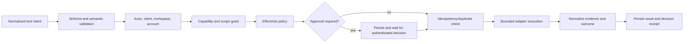

# Tools, MCP, And Connectors

## Canonical Tool Contract

Every capability is normalized before a model sees or calls it. A tool definition contains:

```text
id                    stable namespace.name identifier
version               behavior/schema version
title/description     concise model and user descriptions
input_schema          JSON Schema 2020-12
output_schema         JSON Schema 2020-12
effects               one or more deterministic effect classes
risk                  0..3 baseline risk
required_scopes       actor/client/workspace grants
approval_policy       auto / ask / always_ask / deny / policy
timeout               execution deadline
retry_policy          normalized and effect-aware
idempotency           unsupported / optional / required / provider_key
source                native / connector / MCP / runtime / extension
availability          health and configuration requirements
sensitivity           input/output data classification
```

Tool names are namespaced and collisions are errors. Descriptions help model selection but never determine authorization.

## Effect And Risk Model

Effect classes are independent and composable:

- `READ_ONLY`
- `WRITE`
- `EXTERNAL_COMMUNICATION`
- `DESTRUCTIVE`
- `CODE_EXECUTION`
- `FINANCIAL`
- `PRIVILEGED`

Default risk guidance:

| Risk | Typical operation | Default posture |
| --- | --- | --- |
| 0 | read calendar, search mail metadata | auto when scoped |
| 1 | create local draft, save reversible note | auto or ask by workspace policy |
| 2 | send one message, create meeting, modify cloud record | fresh approval |
| 3 | delete, spend, deploy, change permissions, mass-send | always ask or deny |

Context can raise risk but cannot lower a hard policy floor. Examples include an unusually large recipient set, production target, external domain, sensitive attachment, or ambiguous identity.

## Execution Pipeline



The executable adapter receives an authorization receipt, secret resolver, cancellation token, deadline, idempotency key, and correlation IDs. It does not receive an unrestricted application context.

## Outcome Honesty

External actions can be ambiguous. Normalize at least:

- `requested`: intent exists but has not reached an adapter
- `authorized`: policy/approval passed
- `submitted`: provider accepted the request
- `confirmed`: provider supplied evidence of completed effect
- `failed`: evidence says no effect occurred
- `unknown`: the result cannot establish whether an effect occurred
- `cancelled`: stopped before a known effect boundary

Do not turn a success-sounding string into proof. Preserve provider IDs and receipts separately from user-facing text. Automatic retry of `unknown` is forbidden for non-idempotent effects.

## MCP Roles

JARVIS supports MCP in three roles:

### Client

Connect to third-party MCP servers over stdio or Streamable HTTP. Discover tools/resources/prompts as negotiated, but translate tool definitions into the canonical registry and apply JARVIS scopes, policy, approval, output limits, and audit.

### Host

Manage MCP server lifecycle, configuration, authentication, health, capability refresh, name collisions, protocol versions, and tool-list changes. Local stdio servers run as constrained child processes. Remote servers require URL policy, TLS, auth, SSRF defenses, and egress controls.

### Server

Expose a deliberately selected subset of JARVIS capabilities to external agents. Each client has an identity, scopes, rate limits, workspace, and explicit tool allowlist. Authentication to `/mcp` never implies all-tools access.

As of the 2026-09-20 research snapshot, the current MCP specification and official Rust SDK support stdio and Streamable HTTP, protocol negotiation, OAuth features, and stateless-friendly HTTP behavior. Implementation must re-check the live `llms.txt`, selected specification date, SDK feature matrix, deprecations, and conformance results.

## Connectors

A connector translates a provider account and API into normalized operations. It owns:

- manifest metadata and official documentation links
- account setup and connectivity verification
- OAuth/API-key/service-account flow
- token refresh, revocation, reauthorization, and scope changes
- provider client, pagination, rate limits, retry classification, and request IDs
- webhook/subscription lifecycle and incremental sync cursors
- operation-to-tool registration
- health and secret-redacted diagnostics
- sanitized contract fixtures and opt-in live tests

A connector does not own global policy, approval presentation, canonical memory, or workflow sequencing.

## Connector Manifest

The manifest should be parseable without loading provider code and include:

- stable ID, version, display name, and provider
- supported operations and effect metadata
- auth methods and required/optional scopes
- webhook and polling capabilities
- configuration JSON Schema and secret fields
- data classifications and residency notes
- rate-limit and quota documentation links
- official docs, `llms.txt`, OpenAPI/SDK, changelog, and terms links
- minimum JARVIS version and compatibility status

This enables onboarding, doctor, docs, and tool discovery without initializing every SDK.

## OAuth Requirements

- Authorization Code plus PKCE for user-facing public clients.
- Random state and nonce bound to a short-lived setup transaction.
- Exact redirect URI validation and loopback listener hardening.
- Least-privilege incremental scopes with a clear explanation before consent.
- Token exchange and refresh only inside the connector/secret boundary.
- Refresh-token rotation and invalidation handling.
- Account identity verified from the provider, not user-entered labels.
- Reauth path that preserves account references without hiding lost scopes.
- No token material in model context, URLs/logs, diagnostics, or normal database columns.

## Skills

Tools are atomic capabilities. Skills are versioned procedures composed from tools, policy, memory, and workflow steps, for example `prepare_for_meeting`, `daily_briefing`, or `process_new_lead`.

A skill declares inputs, outputs, required capabilities, effects, checkpoints, approval points, and acceptance tests. A prose file may guide reasoning, but durable and high-risk steps remain machine-enforced.

## High-Risk Adapters

### Filesystem

Use explicit granted roots, handle-based resolution where possible, canonicalization plus race-resistant open semantics, symlink/junction policy, byte/file-count bounds, and trash/undo where supported.

### Browser

Separate browser profile identity, downloads, navigation, authenticated sessions, screenshots, and network egress. Block local/metadata/private-network targets by default and treat page content as prompt-injection data.

### Shell And Code

Run in a sandbox with an allowlisted workspace mount, resource limits, network policy, sanitized environment, bounded output, kill/cancel behavior, and no host credential inheritance. String allowlists alone are not a sandbox.

### Communication

Resolve recipients to canonical entities, show the exact target/content/attachments at approval, preserve provider receipt IDs, and distinguish submission from delivery.

## Connector Completion Gate

A connector is not complete until it has:

- dated official-source research
- manifest and configuration validation
- successful and failed onboarding tests
- auth refresh, revoke, and reauth tests
- pagination and rate-limit tests
- operation contract fixtures
- policy/effect metadata review
- redacted diagnostics
- webhook signature/replay tests if applicable
- documented limitations and a live smoke test where credentials permit