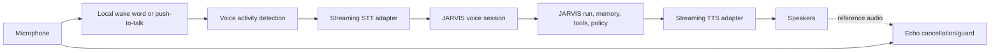
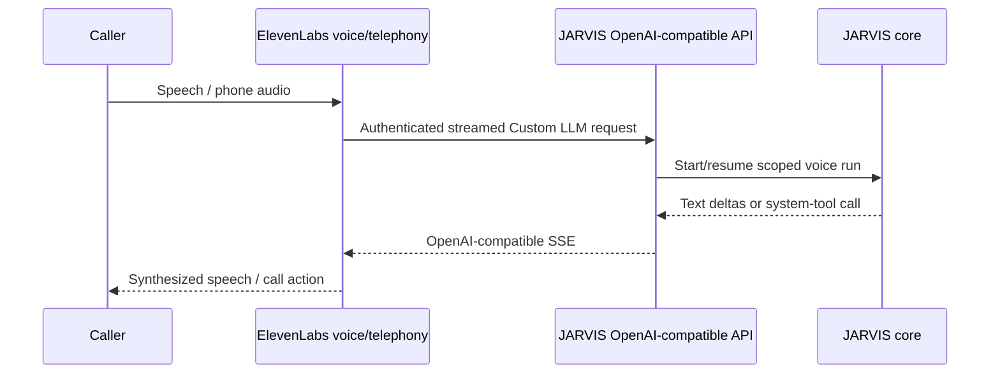
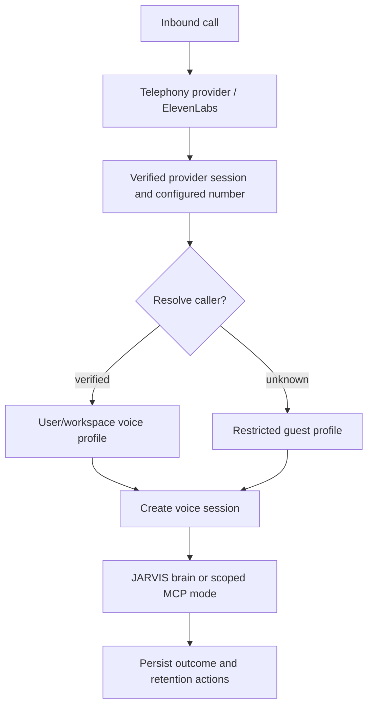

# Voice And Telephony

## Boundary

Voice is a client/channel of JARVIS. It can transport audio, text, interruptions, call controls, and provider metadata, but it does not own canonical identity, reasoning policy, tools, memory, workflow state, approvals, or audit.

Define provider-neutral ports for:

- local audio sessions
- streaming STT
- streaming TTS
- realtime voice sessions
- inbound/outbound calls
- call status and control
- **turn detection and interruption**
- verified provider webhooks

ElevenLabs is the first hosted voice/telephony adapter, not a permanent dependency.

## Local Voice Pipeline



The wake-word detector and push-to-talk gate run locally. Audio is not sent while asleep/muted. Audio-device selection uses stable names/IDs plus runtime probes and reports fallback rather than silently changing devices.

## Turn Detection

Turn detection is model-based, not a silence window. See [ADR-0010](../adr/0010-model-based-turn-detection.md) for the decision and the evidence; this section defines the contract.

The session emits turn events, not only transcripts:

| Event | Meaning | Required handling |
| --- | --- | --- |
| `EndOfTurn` | A turn boundary with a confidence | Persist as the canonical boundary; do not treat the confidence as comparable across providers |
| `EagerEndOfTurn` | Speculative boundary — the caller probably finished | May start context build or generation, but the result is a **draft** and must be discardable |
| `TurnResumed` | The caller continued after an eager boundary | Discard speculative work; never surface a draft reply |
| `FalseInterruption` | Speech stopped agent playback but was not a real interruption (cough, noise) | Resume the interrupted response where it stopped, within a timeout |
| `Backchannel` | Short acknowledgement ("uh-huh", "yeah") | Never interrupts; must not be treated as a turn |

Rules:

- The silence timer is a **maximum-silence cap**, not the turn mechanism. A provider under model-based detection reinterprets it that way, so it may be raised without adding latency.
- Turn detection is measured and reported **separately** from perceived response latency. The two are additive; combining them hides the metric this design exists to improve.
- Interruption sensitivity, backchannel suppression, and input-during-speech reporting are explicit session policy with recorded values. Provider defaults for these have changed without notice.
- A provider that cannot express a given event reports the capability as unsupported. It is never substituted with a similar-looking event, because a false interruption reported as a real one silently cancels valid speech.

Local push-to-talk bypasses turn detection by design; it is a gate, not a prediction.

## Interruption

Interruption is an explicit state transition: stop generation where possible, cancel/flush queued synthesis, preserve a transcript boundary, and accept new input. It is tested on real hardware separately from deterministic session tests.

Distinguish the four causes, because they have different correct responses: a real interruption ends the turn, a backchannel is ignored, a false interruption resumes playback, and a transport-level flush (a provider `clear`/`interrupt` frame) is not evidence about the caller at all. Treating a transport flush as caller intent is the common defect.

## Voice Session Contract

A session carries:

```text
voice_session_id
provider/provider_session_id
channel (local, web, phone, meeting)
participants (one authenticated caller by default; extra participants only under recorded session scope)
media (audio only by default; camera and screen share are opt-in per session)
authenticated client/caller evidence
resolved user and workspace, or guest policy
linked JARVIS session/run IDs
language and voice preferences
audio formats and latency timestamps
allowed capabilities
turn-detection policy (mode, thresholds, max-silence cap, backchannel suppression)
interruption policy (sensitivity, input-during-speech reporting, resume timeout)
recording/transcript/retention policy
consent/disclosure state
status and termination reason
```

Turn and interruption policy are part of the session, not adapter configuration, because they change what the caller hears and must be reproducible when a call is reviewed or replayed. Record the provider's effective values as evidence alongside the requested ones: a provider may silently ignore an unknown attribute name.

Participants and media are session scope, not adapter capability. A transport that can carry video or admit a third participant does not thereby grant either: the session contract decides, the decision is recorded, and an unexpected track or participant is refused rather than rendered. Consent, retention, and deletion apply per participant and per media type. See `FR-VOICE-007` and `NFR-PRIV-002`.

Phone number, SIP header, dynamic variable, or provider `user_id` is not sufficient identity alone. Resolve it through configured verified mappings, challenge/OTP/account context where needed, and default unknown callers to a restricted guest profile.

## ElevenLabs Mode A: JARVIS Is The Brain

This is the preferred personal-JARVIS mode.



Official ElevenLabs docs verified on 2026-09-20 support custom servers compatible with:

- `POST /v1/responses`, streamed as SSE with `response.output_text.delta`, `response.completed`, then `data: [DONE]`
- `POST /v1/chat/completions`, streamed as SSE data chunks ending in `data: [DONE]`

ElevenLabs may include standard OpenAI-format system tools such as end call, language detection, transfer, skip turn, and voicemail detection. The compatibility adapter normalizes these into a narrow voice-control namespace. JARVIS policy still decides whether a transfer, outbound communication, or other JARVIS tool is allowed.

Do not expose the general model gateway directly. The voice endpoint creates a scoped JARVIS run and uses allowlisted custom fields to bind the provider conversation to a pre-created short-lived voice session.

## ElevenLabs Mode B: ElevenLabs Agent Uses JARVIS MCP

An ElevenLabs-owned agent may connect to JARVIS's remote MCP endpoint for a specialized use case. Current ElevenLabs docs support SSE and Streamable HTTP MCP servers plus per-server/per-tool approval settings.

JARVIS treats ElevenLabs as an external MCP client:

- dedicated OAuth/client credential or rotated secret
- one workspace and explicit tool allowlist
- conservative rate/concurrency limits
- no administrative or raw-memory capabilities
- JARVIS approvals remain authoritative even if ElevenLabs also asks for approval
- audit links provider conversation, MCP client, tool call, and user decision

Current ElevenLabs documentation says MCP is unavailable for Zero Retention Mode and HIPAA-required workspaces. This mode must not be offered where those constraints apply. Re-check at implementation time.

## ElevenLabs Mode C: Speech Provider Only

JARVIS may use ElevenLabs streaming STT/TTS or Speech Engine while retaining its own local/web session transport. This mode uses `VoiceProvider` and `SpeechProvider` ports and does not require an ElevenLabs-owned agent.

## Custom Brain Transports

ElevenLabs supports two mechanisms for a JARVIS-owned brain. They are alternatives, not layers:

| | OpenAI-compatible (Mode A) | Speech Engine (Mode A')
| --- | --- | --- |
| Transport | HTTP request per turn, SSE response | one WebSocket per conversation |
| JARVIS surface | `POST /v1/responses` (preferred), `POST /v1/chat/completions` | brain WebSocket server |
| Audio | handled by the provider | `ulaw_8000` both ways; matches Twilio Media Streams, so no transcoding |
| Auth | voice-session credential on the request | shared secret on the WS upgrade plus a per-call signed URL |

Both create a scoped JARVIS run. Neither is a model gateway, and neither may bypass policy: a tool requested by the brain re-enters the JARVIS tool gateway exactly as in any other channel. The Speech Engine path adds a bridge that relays provider audio to the telephony stream and translates provider `interruption` into the transport's own buffer-clear — that translation is a transport concern and must not be mistaken for a caller intent signal.

Choose one per deployment and record which; running both against one number produces two brain sessions for a single call.

## Transport Selection

- **Cascaded** (STT → JARVIS run → TTS) is the default. It keeps memory, voice selection, barge-in, and reconnection.
- **Speech-to-speech** (raw audio in and out) is adopted only with a measured latency requirement it satisfies. The measured gain over a streamed cascaded pipeline was inside single-call noise; the capability loss was not.
- Telephony audio is frequently 8kHz μ-law or G722. Resampling happens at the adapter boundary and is covered by a round-trip test with an amplitude and waveform check, not only a decode test.

## Inbound Calls



An incoming call has no broad tool authority by default. Sensitive data disclosure and effectful actions may require a second factor or approval on a trusted client.

## Outbound Calls

Outbound calling is a tool effect classified as external communication and usually risk 2. A workflow may auto-call only under an explicit standing policy defining recipient, reasons, time windows, frequency, and escalation limits.

The provider-neutral tool family is:

```text
voice.call.start
voice.call.status
voice.call.end
```

The ElevenLabs Twilio adapter currently maps `start` to its outbound-call API with `agent_id`, `agent_phone_number_id`, `to_number`, optional dynamic variables/user ID, and bounded conversation overrides. The SIP adapter uses the current SIP outbound API/phone-number configuration. These mappings must be regenerated or hand-verified against current OpenAPI before release.

Store JARVIS call ID, provider call/conversation IDs, intended recipient entity, normalized/E.164 target, reason, policy/approval receipt, initiating event/workflow, timestamps, status, costs, transcript/audio references, and terminal outcome.

## SIP

Current ElevenLabs SIP documentation supports inbound/outbound trunks, digest or ACL authentication, TLS signaling, and optional/required media encryption. Production defaults are TLS 1.2+ and required SRTP when the trunk supports it. G711 8 kHz and G722 16 kHz constraints are adapter metadata and may require resampling.

Validate certificates and remote domains, normalize E.164 identifiers consistently, preserve call IDs, and treat custom `X-` headers as untrusted data even when exposed as dynamic variables. Do not put secrets in SIP headers.

SIP trunks are not ElevenLabs-specific and must not be modelled as such. Twilio, Telnyx, Plivo, Sinch, Wavix, and didlogic all terminate SIP and differ mainly in number provisioning and trunk authentication; a telephony adapter is chosen by configuration, and switching providers is a trunk change rather than a code change.

Two provider behaviours to plan for rather than discover:

- **A number routes either to a trunk or to a webhook, not both.** Attaching a number to both produces a silent, single-path result. The choice is made in exactly one place and logged.
- **Two TwiML verbs that both start an audio conversation are mutually exclusive, and the platform runs only one without error or warning.** A call intended for one architecture can quietly run as the other, and every measurement from it is then attributed to the wrong system. Engine selection is therefore a single explicit decision per call, recorded on the call record.

## Webhooks And Reconciliation

ElevenLabs post-call events include transcription, optional audio, and call-initiation failure. Verify the `ElevenLabs-Signature` HMAC over the raw body using a secret reference and enforce the SDK's timestamp validation. Optionally combine this with documented static egress allowlisting.

Webhook handling:

1. Read a bounded raw/chunked body.
2. Verify signature before trusting JSON.
3. Deduplicate and persist the event.
4. Return success promptly.
5. Reconcile call state asynchronously.
6. Store transcript/audio only if policy permits.

Provider callbacks can arrive late or out of order. State transitions compare provider timestamps/sequence evidence and never regress a terminal call to an active state.

## Privacy, Consent, And Safety

- Configure whether audio, transcripts, summaries, and provider analytics are retained.
- Provide clear AI/recording disclosure where required.
- Store recordings as sensitive objects with short default retention and separate access grants.
- Redact or omit sensitive trace content; never log raw audio or full transcripts by default.
- Support deletion locally and document provider-side retention/deletion.
- Enforce quiet hours, timezone, recipient consent, do-not-call rules, rate limits, and applicable telemarketing law for outbound calls.
- Never use voice alone to authorize financial, destructive, credential, or emergency actions by default.

## Latency And Reliability

Measure these as separate numbers, because they are additive and a single "response time" makes a regression unattributable:

1. caller stopped speaking → turn boundary detected
2. turn boundary → context build complete
3. context build → model time to first token
4. first token → time to first audible response
5. per-tool latency
6. interruption → playback actually stopped
7. end-to-end turn time

Turn detection is the number most often missing and the one a silence window hides, because it is paid inside the provider before JARVIS sees a transcript.

Speculative work started on an eager turn boundary is counted separately and its discarded results are recorded; they cost money and must not be invisible.

User-visible acknowledgements may be streamed when truthful; they must not claim an action has begun before it has.

Failures are explicit: no answer, busy, voicemail, rejected, provider unavailable, custom LLM timeout, tool denied, transfer failed, dropped call, and unknown. Each has retry and notification policy; outbound retries obey frequency/consent constraints. A failure that arrives after the provider accepted the request is `unknown`, not `failed`, and is never retried automatically.

## Acceptance Tests

- Unknown caller gets only guest capabilities.
- Forged caller/dynamic-variable identity cannot select another workspace.
- Custom LLM streaming fixtures pass both endpoint contracts.
- Speech Engine brain session maps to one scoped run and rejects a wrong or missing shared secret.
- Voice system tool calls cannot bypass JARVIS policy.
- ElevenLabs MCP client sees only granted tools.
- Outbound call requires policy/approval and is idempotent.
- HMAC failure and replay are rejected before event admission.
- Post-call events reconcile out of order.
- Recording/transcript disabled means no local object is retained.
- Provider outage degrades voice without corrupting the linked JARVIS session.
- A pause-heavy request ("...reply to the one from Sam, uh, the invoice") is not cut off at the silence threshold.
- A backchannel or cough during agent speech does not cancel the reply; a real interruption does.
- A false interruption resumes the interrupted response; the resumed audio does not repeat completed sentences.
- Turn-detection latency is reported separately from perceived response latency.
- Audio codec round-trip preserves amplitude and waveform, not just decodability.

## Related Records

- Provider evidence: [ElevenLabs](../research/integrations/elevenlabs.md), [Twilio](../research/integrations/twilio.md), [Deepgram](../research/integrations/deepgram.md), [LiveKit](../research/integrations/livekit.md), [Google Gemini Live](../research/integrations/google-gemini-live.md)
- Decision: [ADR-0008](../adr/0008-provider-neutral-voice.md), [ADR-0010](../adr/0010-model-based-turn-detection.md)